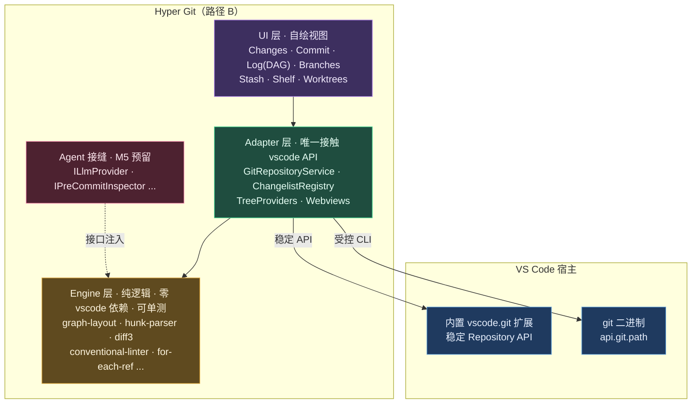

<p align="center">
  
</p>

<h1 align="center">Hyper Git</h1>

<p align="center">为 VS Code 带来统一的 <b>Git 变更管理</b> 与 <b>提交工作流</b>——多变更分组、自绘提交面板、可视化提交图、Shelf、行级提交，并为未来 git 管理的 AI Agent 自主代理能力预留架构接缝。</p>

<p align="center">
  <a href="https://github.com/ThreeFish-AI/hyper-git/actions/workflows/ci.yml"></a>
  <a href="https://github.com/ThreeFish-AI/hyper-git/blob/HEAD/LICENSE"></a>
  = 1.85" />
</p>

## 为什么需要 Hyper Git

在重度 Git 协作中，开发者高频依赖一套统一的变更管理工作流：把改动分组到命名列表、在专门的提交面板里逐项勾选并校验、用可视化提交图审阅历史、用 Shelf 临时搁置改动、按行/按 Hunk 精确提交。VS Code 原生 Source Control 视图在这些能力上**存在空缺**：没有多 Changelist、没有忠实的提交窗口、没有提交前检查流水线、没有 Shelf、没有行级提交、没有可视化提交图。Hyper Git **补齐这些能力**，并与原生 Source Control 平行共存、零冲突。

## 核心能力（v0.0.5）

- **多 Changelist Changes 视图**：将改动分组到命名列表，设活动列表为提交目标，新建/重命名/删除/移动，`workspaceState` 持久化（重启恢复）；状态色复用 `gitDecoration.*` 主题色。
- **Commit 提交窗口**：自绘提交面板 + Conventional Commits 实时校验 + Amend / Sign-off / 跳过 Hook + 提交 / 提交并推送；勾选集即提交权威范围；最近消息复用。
- **Log 提交图（自绘 DAG）**：彩色泳道、分叉·合并连线、HEAD/分支/标签徽标，虚拟滚动增量加载；7 个可组合过滤器（作者/路径/grep/正则/合并模式/日期/清除）；per-commit 操作（Reset、新建分支·标签、Cherry-Pick、Revert、查看包含分支）。
- **Branches 分支管理**：收藏/本地/远程/标签四段分组 + ahead·behind·upstream 跟踪；新建/检出/删除/重命名/合并/变基/比较/收藏；**多选批量**删除、复制引用、收藏（已合并/未合并诚实分栏确认）。
- **Stash & Shelf**：Stash 全操作（含 keep-index / clear / 从 Stash 建分支）；独立 **Shelf**（基于 patch、独立于 stash，含 3-way 合并 Unshelve）。
- **Worktrees**：全生命周期管理——新建（新分支/检出/detached）、在新窗口打开、锁定/解锁、移动、删除、清理失效。
- **行级与 Hunk 提交**：编辑器内 CodeLens「提交此 Hunk」、部分暂存/取消暂存、光标处暂存、Hunk 归属 Changelist。
- **远程与冲突**：Pull/Push/Fetch + Push…/Update…/Merge… 对话框（force-with-lease / rebase / squash 等）+ 自绘 **3-way Merge Editor** 与冲突兜底引导。
- **历史编辑**：Cherry-Pick、Revert、Reset、交互式 Rebase、Undo/Drop/Fixup/Reword。
- **其他**：Blame 行内注解、Patch 导出/应用、Reflog、3-way Diff 概览、Discard、Diff（HEAD ↔ Working）。

> 规模：**7 视图 / 93 命令 / 6 配置项**，覆盖 Git 变更管理主线工作流。完整发布说明见 [Release Note v0.0.5](./docs/releases/v0.0.5.md)。

## 架构（路径 B：消费 + 自绘）

- **消费** 内置 `vscode.git` 导出的稳定 `Repository` API 作为 git 底座，不重造 git 状态机。
- **受控 CLI 通道**：稳定 API 未覆盖的能力（cherry-pick / revert / reset / 分支重命名 / hunk 暂存 / stash 列表 / graph 拓扑 / shelf 等）经 `GitRepositoryService.execGit` 复用同一 git 二进制（`api.git.path`）实现。
- **自绘视图** 承载完整的变更管理 UI；纯逻辑沉淀于 `engine/`（零 vscode 依赖、可单测）。
- **AI 接缝**：预留 `ILlmProvider` / `IPreCommitInspector` 等 5 个接口（设计参考 JetBrains `CheckinHandler` 提交生命周期），实现延后至 M5。



## 安装

- **手动（当前推荐）**：从 [Releases](https://github.com/ThreeFish-AI/hyper-git/releases) 下载 `hyper-git-0.0.5.vsix` → 命令面板 `Extensions: Install from VSIX`。
- **OpenVSX**（Cursor / Windsurf / Gitpod / VSCodium）：搜索 `Hyper Git`。
- **VS Code Marketplace**：搜索 `Hyper Git`（发布上线后可用）。
- **要求**：VS Code ≥ 1.85.0 + 启用内置 Git 扩展（`vscode.git`，默认随附）。仅支持本地 git 仓库，不支持虚拟 / Web 工作区。

## 已知限制

- Commit 窗口的 Co-authored-by / Author 覆盖（`--author`）/ 撤销最近提交的**按钮 UI 接线**（engine `trailer` 已就绪，仅缺 webview 交互）。
- Partial 多文件选择 UX、行级 split chunks（按选定行拆分提交）。
- 目录 / folder diff（虚拟文档）、Submodules 管理。
- M5 AI Agent（5 个接缝已预埋 Null 实现，本版未启动）。

详见[工程实施方案](./docs/architecture/engineering-plan.md)、[实施状态总览](./docs/milestones/implementation-status.md)与[知识索引](./docs/.agents/knowledge-map.md)。

## 路线图

| 里程碑 | 主题 | 状态 |
|---|---|---|
| M0 | 脚手架 + CI | ✅ |
| M1 | Git Adapter + Changes TreeView（多 Changelist） | ✅ |
| M2 | Commit 提交窗口（模板 / Amend / CC 校验 / Hook 链） | ✅ |
| M3 | Log（Graph DAG） + Branches + Diff/Blame | ✅ |
| M4 | Stash / Shelf / 行级提交 / Worktrees | ✅ |
| M5 | AI Agent（接缝已预留，实现待启动） | ⏳ |

## 开发

```bash
pnpm install                  # 安装依赖
pnpm run compile              # 类型检查 + lint + 构建
pnpm run watch                # 监听构建（F5 启动 Extension Host 调试）
pnpm run test:unit            # 单元测试（engine 纯逻辑，Vitest，280 例）
pnpm run test:integration     # 集成测试（@vscode/test-electron）
pnpm run package              # 生产构建
pnpm dlx @vscode/vsce package # 打包 .vsix
```

- **分层**：`engine/`（纯逻辑）→ `adapter/`（唯一接触 vscode API）→ `ui/`；`agent/` 以接口注入 `engine`，不反向依赖 UI；`shared/protocol.ts` 为 Webview ↔ Host 契约单一事实源。
- **发布**：`v*` 标签触发 CI 产出 GitHub Release（附 `.vsix`，正文取自 [`docs/releases/`](./docs/releases/README.md)）+ OpenVSX；VS Code Marketplace 由 `ENABLE_MARKETPLACE_PUBLISH` 变量门控。
- 包管理与脚本统一使用 `pnpm`（遵循 [AGENTS.md](./AGENTS.md) 工程规范）。完整文档见[文档中心](./docs/README.md)。

## 许可证

[MIT](./LICENSE)。图标字形改编自 [Tabler Icons](https://github.com/tabler/tabler-icons)（MIT）。
