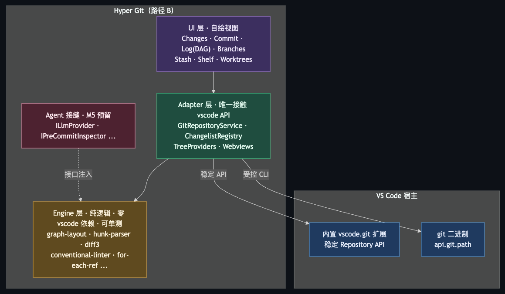

<p align="center">
  
</p>

<h1 align="center">Hyper Git</h1>

<p align="center">A unified <b>Git change-management</b> and <b>commit workflow</b> for VS Code — multi-changelist grouping, a hand-built commit panel, a hand-rendered commit graph, Shelf, and line-level commits, with architectural seams reserved for future AI-driven Git agents.</p>

<p align="center">
  <a href="https://github.com/ThreeFish-AI/hyper-git/actions/workflows/ci.yml"></a>
  <a href="https://github.com/ThreeFish-AI/hyper-git/blob/HEAD/LICENSE"></a>
  = 1.85" />
</p>

<p align="center">
  <b>English</b> · <a href="./docs/i18n/zh-CN/README.md">简体中文</a>
</p>

<p align="center"><sub>6 views · 97 commands · 6 settings · 324 unit tests</sub></p>

## Features

- **Multi-Changelist Changes view**: group edits into named lists, mark one as the active commit target, create / rename / delete / move lists, persisted in `workspaceState` (restored across restarts); status colors reuse the `gitDecoration.*` theme tokens.
- **Commit panel**: a hand-built commit view with real-time Conventional Commits validation, Amend / Sign-off / skip hooks, and Commit / Commit & Push; the checkbox selection is the authoritative commit scope, and recent messages are reusable.
- **Log commit graph (hand-rendered DAG)**: colored swimlanes, branch/merge edges, HEAD/branch/tag badges, virtualized incremental loading; 7 composable filters (author / path / grep / regex / merge-mode / date / clear); per-commit actions (Reset, new branch·tag, Cherry-Pick, Revert, list containing branches).
- **Branches management**: favorites / local / remote / tags grouped into four sections with ahead·behind·upstream tracking; create / checkout / delete / rename / merge / rebase / compare / favorite; **multi-select batch** delete, copy ref, and favorite (with an honest merged/unmerged split confirmation).
- **Stash & Shelf**: full stash operations (including keep-index / clear / create branch from stash); a standalone **Shelf** (patch-based, independent of stash, with 3-way merge Unshelve).
- **Worktrees**: full-lifecycle management — create (new branch / checkout / detached), open in a new window, lock / unlock, move, remove, and prune stale entries.
- **Line-level & hunk commits**: in-editor "Commit this Hunk" CodeLens, partial stage / unstage, stage at cursor, and hunk-to-changelist attribution.
- **Remote & conflicts**: Pull / Push / Fetch plus Push… / Update… / Merge… dialogs (force-with-lease / rebase / squash, etc.) and a hand-built **3-way Merge Editor** with conflict-resolution fallbacks.
- **History editing**: Cherry-Pick, Revert, Reset, interactive Rebase, Undo / Drop / Fixup / Reword.
- **More**: inline Blame annotations, patch export / apply, Reflog, 3-way diff overview, Discard, and Diff (HEAD ↔ Working).

## Architecture (Path B: Consume + Hand-render)

- **Consumes** the stable `Repository` API exported by the built-in `vscode.git` extension as its Git foundation, rather than rebuilding a Git state machine.
- **Controlled CLI channel**: capabilities the stable API does not cover (cherry-pick / revert / reset / branch rename / hunk staging / stash listing / graph topology / shelf, etc.) run through `GitRepositoryService.execGit`, reusing the same Git binary (`api.git.path`).
- **Hand-rendered views** carry the full change-management UI (webviews live under `adapter/webview/`); pure logic is distilled into `engine/` (zero `vscode` dependency, unit-testable).
- **AI seams**: 5 interfaces (`ILlmProvider` / `ICommitMessageProvider` / `IPreCommitInspector` / `IChangelistGrouper` / `IConflictResolver`) are reserved (design inspired by JetBrains' `CheckinHandler` commit lifecycle), currently shipped as Null implementations; the full implementation is deferred to M5.

<p align="center">
  
</p>

## Install

- **Manual (recommended for now)**: download `hyper-git-agentic-git-x.x.x.vsix` from [Releases](https://github.com/ThreeFish-AI/hyper-git/releases) → run `Extensions: Install from VSIX` in the Command Palette.
- **VS Code Marketplace**: search for `Hyper Git - Agentic Git`.
- **Requirements**: VS Code ≥ 1.85.0 with the built-in Git extension enabled (`vscode.git`, bundled by default). Local Git repositories only — virtual / Web workspaces are not supported.

## Known Limitations

- Button-UI wiring for the commit panel's Co-authored-by / Author override (`--author`) / undo-latest-commit (the engine `trailer` is ready; only the webview interaction is missing).
- Partial multi-file selection UX and line-level split chunks (splitting a commit by selected lines).
- Directory / folder diff (virtual documents) and Submodules management.
- The M5 AI agent (all 5 seams are pre-wired with Null implementations; not started in this release).

See the [Engineering Plan](./docs/architecture/engineering-plan.md), the [Implementation Status overview](./docs/milestones/implementation-status.md), and the [Knowledge Map](./docs/.agents/knowledge-map.md) for details.

## Roadmap

| Milestone | Theme                                                        | Status |
| --------- | ------------------------------------------------------------ | ------ |
| M0        | Scaffolding + CI                                             | ✅     |
| M1        | Git adapter + Changes TreeView (multi-changelist)            | ✅     |
| M2        | Commit panel (template / Amend / CC validation / hook chain) | ✅     |
| M3        | Log (Graph DAG) + Branches + Diff/Blame                      | ✅     |
| M4        | Stash / Shelf / line-level commits / Worktrees               | ✅     |
| M5        | AI agent (seams reserved, implementation pending)            | ⏳     |

## Development

```bash
pnpm install                  # install dependencies
pnpm run compile              # type-check + lint + build
pnpm run watch                # watch build (press F5 to launch the Extension Host debugger)
pnpm run test:unit            # unit tests (pure engine logic, Vitest, 324 cases)
pnpm run test:integration     # integration tests (@vscode/test-electron)
pnpm run package              # production build
pnpm dlx @vscode/vsce package # package the .vsix
```

Packaging and publishing with vsce (`@vscode/vsce`):

```bash
pnpm dlx @vscode/vsce package
# hyper-git-agentic-git-x.x.x.vsix generated
pnpm dlx @vscode/vsce publish
# ThreeFish-AI.hyper-git-agentic-git-x.x.x published to VS Code Marketplace
```

- **Layering**: `engine/` (pure logic) → `adapter/` (the sole layer touching the vscode API, including the hand-rendered `adapter/webview/` UI); `agent/` is injected into `engine/` via interfaces and never depends on the UI; `shared/protocol.ts` is the single source of truth for the Webview ↔ Host contract.
- **Release**: a `v*` tag triggers CI to produce a GitHub Release (with the `.vsix` attached; the body is drawn from [`docs/releases/`](./docs/releases/README.md)) and publish to the VS Code Marketplace (gated by the `ENABLE_MARKETPLACE_PUBLISH` variable; `rc` tags go to the pre-release channel).
- Package management and scripts standardize on `pnpm` (per the [AGENTS.md](./AGENTS.md) engineering conventions). Version history is tracked in the [Changelog](./CHANGELOG.md). See the [documentation hub](./docs/README.md) for the full docs.

---

<div align="center">
  <sub>Built with 🧠, ❤️, and an absurd amount of coffee by <a href="https://github.com/ThreeFish-AI">ThreeFish-AI</a> · Released under the <a href="./LICENSE">MIT License</a>.</sub>
</div>
