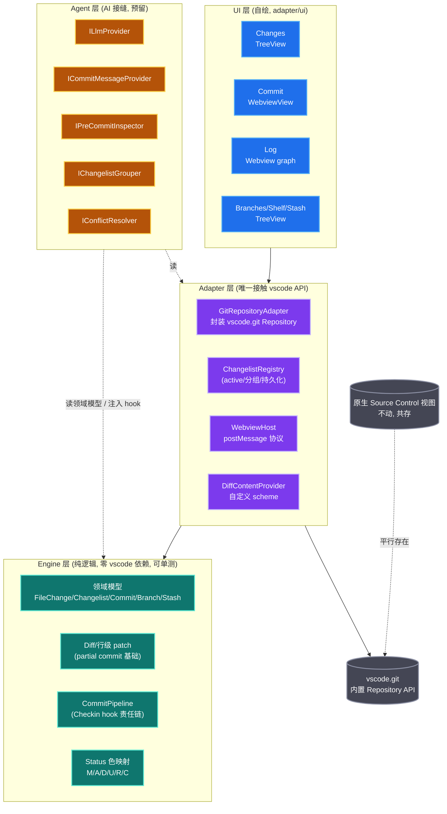

# Hyper Git — VS Code 扩展工程实施方案

> 提供完整的「Git 变更管理 + Commit 提交工作流」（功能完备性参考 IntelliJ IDEA 等成熟实现），并为未来 AI Agent 自主代理预留架构接缝。
> 决策已与用户确认：**路径 B**（消费 `vscode.git` API + 自建 changelist registry + 独立视图容器）、扩展命名 **Hyper Git**、**双市场发布**、**AI 现仅预留接缝 + Null 实现、延后至 M5**。

---

## 0. Context（背景与目标）

**为什么做**：IntelliJ IDEA 的统一 Git 工具窗口（顶部 `Commit/Shelf/Stash` 标签页 + Changes 变更树 + Commit Message 编辑区 + 提交前 Inspection）是 Java/全栈开发者高频依赖的工作流，但迁移到 VS Code 后只能用原生 Source Control 视图（无多 changelist、无独立 Commit 窗口、无提交前检查流水线）。本项目目标是**在 VS Code 上提供同等完备的 Git 变更管理与提交工作流**，并在未来为 git 管理引入 AI Agent（提交信息生成 / 提交前代码审查 / 变更语义分组 / 冲突解决）。

**当前状态**：仓库为全新 greenfield 工程（仅有 `.agents/` 文档脚手架与 AGENTS.md 协议，无源码 / 无 package.json / 无 README）。本方案从零搭建。

**循证基线**（已读源码 / 官方文档交叉验证）：
- IDEA 侧：56 个原子功能点 / 8 组 + `CheckinHandler` 11 个 hook 生命周期（`git4idea` + `vcs-api/vcs-impl` 源码）。
- VS Code 侧：`vscode.git` 导出的稳定 `Repository` API（`extensions/git/src/api/git.d.ts` 已逐行复核）；`scmHistoryProvider`/`scmMultiDiffSource` 仍是 proposed API（上架禁用）；`SourceControlInputBoxValueProvider` 已删除。
- IDEA 多 changelist 模型（active 概念 + 跨列表行级归属 `PartialLocalLineStatusTracker`）**无法**用原生 SCM group 1:1 表达 → 必须自建 changelist registry。

---

## 1. 核心架构决策（路径 B）

| 决策项 | 结论 | 循证依据 |
|---|---|---|
| **git 操作底座** | 消费内置 `vscode.git` 扩展导出的 `API`（`getAPI(1)` → `Repository`），**不自调 git CLI、不重造状态机** | `git.d.ts` 已暴露 commit/add/revert/diff/blame/log/stash/branch/merge/rebase 全套；GitHub PR 扩展即此模式 |
| **changelist 表达** | **自建 changelist registry**（借鉴 JetBrains `ChangeListManager` 设计），以 TreeView 渲染；**不**注册竞争性 SCM Provider | Track1：IDEA active 列表 + 跨列表行级归属，原生 SCM group 无法表达 |
| **视图容器** | 活动栏新建独立视图容器 `hyper-git`，承载 Changes/Commit/Log/Branches/Shelf/Stash；**不接管/不替代原生 Source Control 视图**（避免双胞胎冲突） | Track2：注册独立 SCM 会与原生 git 视图并列混淆 |
| **Commit 编辑器** | WebviewView 自绘（多行 / 模板 / Conventional Commits 校验 / Amend / Author / sign-off） | 原生 `SourceControlInputBox` 仅 `value` 字段，Provider 已删除 |
| **Log 提交图** | Webview 自绘 SVG graph + 消费 `Repository.log()` | `scmHistoryProvider` 为 proposed，上架不可用 |
| **Diff 预览** | 复用 `vscode.diff` + `api.toGitUri(uri,'HEAD')`（零成本） | Track2 §5.5 |
| **发布** | 双市场（Marketplace + OpenVSX） | Cursor/Windsurf 走 OpenVSX；AI 受众主战场 |
| **AI** | 现仅定义接缝 + Null 实现，实现延后 M5 | YAGNI + 借鉴 JetBrains `CheckinHandler` 责任链语义 |

**架构总览（Mermaid，深色模式高对比）**：



**依赖方向（单向，正交）**：`UI → Adapter → Engine`；`Agent` 以接口注入 `Engine`/`CommitPipeline`，不反向依赖 UI；`Engine` 零依赖 `vscode`（可被 Vitest 与未来 CLI 双复用，是项目核心 IP）。

---

## 2. 模块正交分解（工程骨架）

```
hyper-git/
├── package.json              # Manifest + contributes（viewsContainers/views/commands/menus/configuration/keybindings）
├── esbuild.js                # 沿用官方 esbuild-sample（CJS, external:['vscode']）
├── tsconfig.json             # strict; @types/vscode 与 engines.vscode 最低版本对齐
├── eslint.config.mjs         # flat config + typescript-eslint
├── .prettierrc
├── .npmrc                    # node-linker=hoisted（规避 vsce/pnpm hoisting）
├── .vscodeignore             # 排除 src/tests/*.config
├── .github/workflows/ci.yml  # lint→build→test 矩阵→package→publish
├── media/                    # 图标 SVG + webview 前端产物（commit-view/log-graph）
└── src/
    ├── extension.ts          # 唯一入口：activate/deactivate，仅装配（DI 注册）
    ├── engine/               # 【引擎层】纯领域逻辑，零 vscode 依赖
    │   ├── model/            #   FileChange / Changelist / Commit / Branch / StashEntry / ConflictHunk
    │   ├── diff/             #   diff 解析 + 行级 patch（partial commit 基础）
    │   ├── commit/           #   CommitPipeline（Checkin hook 责任链，借鉴 JetBrains CheckinHandler 设计）
    │   └── scm-mapping/      #   Status(M/A/D/U/R/C) → decorations 映射（纯函数）
    ├── adapter/              # 【适配层】唯一接触 vscode API
    │   ├── git-repository.ts #   GitRepositoryAdapter：封装 vscode.git Repository（add/commit/diff/log/stash/branch…）
    │   ├── changelist-registry.ts # ChangelistRegistry：active 列表/分组/移动/持久化(workspaceState)
    │   ├── tree/             #   TreeDataProvider：Changes / Branches / Shelf / Stash
    │   ├── webview/          #   WebviewView 宿主：Commit 窗口 + Log 图（postMessage 协议）
    │   ├── diff/             #   TextDocumentContentProvider：自定义 scheme 提供任意 ref 版本
    │   ├── commands/         #   command 注册分发 + menu when-clause 上下文键
    │   └── storage/          #   globalState/workspaceState/SecretStorage 封装
    ├── agent/                # 【代理层】AI 接缝（预留，Null 实现）
    │   ├── llm-provider.ts   #   ILlmProvider（模型来源抽象：vscodeLM/byok/openaiCompatible）
    │   ├── commit-message.ts #   ICommitMessageProvider（生成 + Conventional Commits 校验）
    │   ├── pre-commit.ts     #   IPreCommitInspector（借鉴 JetBrains beforeCheckin/CommitCheck 机制）
    │   ├── grouper.ts        #   IChangelistGrouper（语义分组）
    │   ├── conflict.ts       #   IConflictResolver（三方合并建议）
    │   └── chat-tools.ts     #   IChatToolRegistrar（M5 暴露 git 能力给 Agent）
    ├── ui/                   # 【UI 层】webview 前端（独立 esbuild iife bundle → media/）
    │   ├── commit-view/      #   Commit 窗口前端（多行编辑器 + 模板/校验/Amend/Author）
    │   ├── log-graph/        #   Log 图渲染（SVG graph + 过滤）
    │   └── shared/           #   共享组件
    ├── shared/
    │   └── protocol.ts       # 【单一事实源】webview↔host 消息类型契约（前后端共引）
    └── infra/                # 日志（OutputChannel）/ 错误处理 / 事件总线 / 配置读取
└── tests/
    ├── unit/                 # Vitest：engine/* 与 diff/scm-mapping 纯逻辑（无 vscode 依赖）
    ├── integration/          # @vscode/test-electron + Mocha：adapter/* 适配层
    └── fixtures/             # 最小化 git 仓库 fixture
```

**职责边界**：`engine/` 零依赖 `vscode`（Vitest 可测、未来 CLI 可复用）；`adapter/` 是唯一接触 `vscode` API 的层；`agent/` 依赖 `engine/` 但不依赖 `adapter/`；`shared/protocol.ts` 是 webview↔host 消息类型唯一来源，杜绝 Split-Brain。

---

## 3. 关键复用点（Reuse-Driven，拒绝重复造轮子）

| 复用对象 | 用途 | 来源 |
|---|---|---|
| `vscode.git` → `Repository` | 所有 git 操作（commit/add/revert/clean/restore/diff*/blame/log/createBranch/merge/rebase/createStash/applyStash/popStash/dropStash/fetch/pull/push/checkout） | `extensions/git/src/api/git.d.ts`（已逐行复核） |
| `Repository.state.{indexChanges,workingTreeChanges,untrackedChanges,mergeChanges}` + `Status` 枚举 | 变更数据单一事实源 | 同上 |
| `api.toGitUri(uri, ref)` | 构造任意 ref 版本的资源 Uri（diff 原始端） | 同上 |
| `vscode.commands.executeCommand('vscode.diff', left, right, title)` | 文件 diff 预览（零成本，不自绘 diff） | VS Code 稳定 API |
| `ThemeColor('gitDecoration.modifiedResourceForeground')` 等 | 文件状态色（深色模式一致） | 复用原生 token |
| `@vscode/vsce` / `ovsx` | 打包 / 发布 | 官方工具 |
| `@vscode/test-electron` | 集成测试 | 官方唯一推荐 |
| `esbuild-sample` 模板 | 工程骨架零点（`esbuild.js` + scripts） | microsoft/vscode-extension-samples |
| `HaaLeo/publish-vs-code-extension` Action | 一键双市场发布 | GitHub Marketplace |

**消费 `vscode.git` API 的声明**：`package.json` 加 `"extensionDependencies": ["vscode.git"]`；TS 类型复制 `git.d.ts` 入仓；运行时 `getExtension<GitExtension>('vscode.git').activate().getAPI(1)`。

---

## 4. 功能优先级矩阵

> 基于 Track1 的 56 功能点，按价值×依赖×难度分入 P0(MVP)/P1(核心功能)/P2(高级功能)/P3(AI 增强)。完整 56 项明细见 [功能矩阵](../requirements/idea-feature-matrix.md)（后续验收的需求基线）。

| 优先级 | 功能域 | 代表功能（来源 Track1 编号） |
|---|---|---|
| **P0 MVP** | Commit 窗口核心 | 统一窗口容器(#1)、Commit Message 多行编辑(#2 模板/#3 历史)、Commit / Commit and Push(#7)、Amend(#5)、Author/sign-off/skip-hooks(#6/#8/#9)、选择性勾选文件提交(#22)、本地 vs HEAD diff(#35)、Rollback/Discard(#51)、文件状态色 |
| **P0 MVP** | Local Changes | 多 changelist(#15)、active changelist(#16)、新建/删除/重命名(#17-19)、Move changes(#20) |
| **P1 核心** | Commit 检查流水线 | 提交前 Inspection 框架(#10，对接 VS Code Diagnostics)、Commit Checks 顺序闸门(#11)、CRLF/大文件预检(#12)、Conventional Commits 校验(#4，IDEA 无内置需自建 linter) |
| **P1 核心** | Branches | 创建/检出/删除/重命名(#45/#46)、Merge/Rebase/Pull/Push/Fetch(#48)、Compare(#47) |
| **P1 核心** | Stash + Diff | Stash apply/pop/drop(#29/#30)、Annotate(blame)(#37)、Show History(#38) |
| **P2 高级** | Partial / 行级提交 | 按代码块提交(#23)、按行提交(#24)、Move Lines to Changelist(#25)——最难，参考 `PartialChangesUtil` 实现 |
| **P2 高级** | Log 提交图 | graph 自绘(#39)、filter(#40)、cherry-pick/revert from log(#41/#42)、Undo Commit(#43) |
| **P2 高级** | Shelf | 完整 shelve/unshelve with conflict(#27/#28，patch 存储+三方合并)；MVP 先用 stash 近似 |
| **P3 AI 增强** | （M5，接缝现已埋） | AI 提交信息生成、AI 提交前审查、AI 语义分组、AI 冲突解决、AI release notes、Chat Tools 暴露 git 能力 |

---

## 5. 里程碑路线图

> 每个 M：交付物 / 验收标准 / 依赖。版本号遵循 Marketplace 偶数 minor=release、奇数 minor=pre-release 约定（如 `0.2.x` release / `0.3.x` pre-release）。

**M0 — 脚手架 + CI（0.1.0 pre-release）**
- 交付：pnpm 工程、esbuild、tsconfig、ESLint9、Vitest、`@vscode/test-electron`、`.github/workflows/ci.yml`（lint→build→test 矩阵 ubuntu/mac/win + xvfb→package vsix→artifact）、`.vscodeignore`、README 骨架、`shared/protocol.ts`。
- 验收：`pnpm test`（单测+集成）< 3min 全绿；CI 三平台通过；`vsce package` 产 vsix。
- 依赖：无。

**M1 — Git Adapter + Changes TreeView（0.2.0）**
- 交付：`GitRepositoryAdapter`（封装 `vscode.git` API）、`ChangelistRegistry`（active/分组/移动/`workspaceState` 持久化）、Changes TreeView（changelist 一级节点 + 文件叶子 + 状态色 `gitDecoration.*`）、文件单击触发 `vscode.diff` + `toGitUri('HEAD')`。
- 验收：能读取真实仓库 `workingTreeChanges` 并渲染 changelist 树；新建/移动/删除 changelist 持久化重启仍在；单击文件弹出原生 diff。
- 依赖：M0。

**M2 — Commit 提交窗口（0.3.x pre-release）**
- 交付：Commit WebviewView（多行编辑器 + 模板注入 + 历史选填 + Conventional Commits 实时校验 linter + Amend + Author + sign-off + skip-hooks 开关）、底部 Commit / Commit and Push 按钮、`CommitPipeline`（Checkin hook 责任链骨架，Null hooks）、AI 接缝 5 个接口 + Null 实现（`ILlmProvider`/`ICommitMessageProvider`/`IPreCommitInspector`/`IChangelistGrouper`/`IConflictResolver`）、`includedChangesChanged` 等价事件。
- 验收：勾选文件→填 message→Commit 落库（调 `Repository.commit`）；Commit and Push 成功；Amend 修正上一提交；CC 不合规时有提示；hook 链可注入并阻断（用内置非 AI 检查如 TODO 验证）。
- 依赖：M1。

**M3 — Log 图 + Branches + Diff/Blame（0.4.0）**
- 交付：Log Webview（SVG graph + 按作者/路径/日期过滤，消费 `Repository.log`）、cherry-pick/revert from log、Branches TreeView（create/checkout/delete/rename/compare/merge/rebase）、Annotate(blame)、Show History、Reset 对话框（soft/mixed/hard/keep）。
- 验收：Log 图正确渲染拓扑；分支操作经真实 git 验证；blame 行级显示作者。
- 依赖：M1、M2。

**M4 — Shelf + Partial/行级提交 + Stash UI（功能收口，0.6.0）**
- 交付：完整 Shelf（patch 存储 + unshelve 三方合并）、行级 partial commit（参考 `PartialChangesUtil` 实现 + 行级 hunk staging）、Stash 完整 UI（apply/pop/drop/clear/keep-index）、Git Staging Area 模式开关。
- 验收：shelve/unshelve with conflict 可解；单文件部分行可单独提交。
- 依赖：M2、M3。

**M5 — AI Agent（实现接缝，0.7.x pre-release）**
- 交付：`ILlmProvider` 三实现（vscodeLM / byok-Ollama / openaiCompatible，配置驱动）、AI 提交信息生成（流式 + CC 校验）、AI 提交前代码审查（挂 `IPreCommitInspector`，可阻断）、AI 语义分组、AI 冲突解决（用户逐块确认）、`@hyper-git` Chat Participant + `languageModelTools`（`hyper_get_staged_diff`/`hyper_git_blame` 等暴露给任意 Agent）。
- 验收：opt-in 开关启用后 ✨ 按钮出现；AI 审查能阻断不良提交；Chat 工具可被 Copilot Agent 调用。
- 依赖：M2-M4。注：M5 起需 `engines.vscode` 评估上调（LM/Chat API 稳定版本要求）。

---

## 6. AI 集成架构预留点（现建接缝，M5 实现）

> 借鉴 JetBrains `CheckinHandler` 生命周期设计（Track1 D 节：`beforeCheckin`/`CommitCheck.runCheck`/`includedChangesChanged`/`checkinSuccessful`/`checkinFailed`）。**只定义契约 + Null 实现，不引入 Copilot 依赖**（未启用 AI 用户零负担）。

| 接缝（Agent 层） | 借鉴 JetBrains 机制 | 为何现在抽 |
|---|---|---|
| `ILlmProvider`（模型来源抽象） | — | **最关键**：未来切换 vscodeLM/byok/自带 key 的命脉；晚抽则所有 AI 调用散落、迁移成本爆炸 |
| `ICommitMessageProvider` | （IDEA 无内置，插件有） | 提交信息是 commit 流水线核心产物，留接缝让"无 AI→LM→自带 key"平滑切换 |
| `IPreCommitInspector` | `beforeCheckin`/`CommitCheck.runCheck`（返回 COMMIT/CANCEL/DEFER，参考 `ReturnResult`） | 借鉴 JetBrains 20+ 年验证的 hook 闸门机制设计；AI 审查最佳挂载点 |
| `IChangelistGrouper` | （IDEA 无内置） | 写回 changelist 模型（回写工作流，差异化于内置 Copilot） |
| `IConflictResolver` | （IDEA 无内置） | 必须 `prepareInvocation` 用户确认（VS Code 工具确认机制，安全红线） |

**Commit 流水线 hook 注入点**（M2 即建责任链，默认 Null hooks）：
`staged diff → [Hook A: 提交信息生成] → message 定稿 → [Hook B: 提交前检查链=beforeCheckin] → [Hook C: 分组校验] → commit → [Hook D: checkinSuccessful] → push → [Hook E: checkinFailed→Hook F: 冲突解决]`

---

## 7. CI/CD 与发布策略

- **发布渠道**：双市场（Marketplace + OpenVSX）。**立即**：`ovsx create-namespace <publisher>` 并 **claim ownership**（OpenVSX namespace 默认非排他，防抢注）。
- **publisher / 扩展 id**：扩展显示名 **Hyper Git**，id `hyper-git`；publisher 建议与 git owner 一致取 `threefish-ai`（**待你最终确认 publisher id**，创建后不可改）。
- **CI 流水线**（`.github/workflows/ci.yml`）：`push/PR → lint→build→test 矩阵(ubuntu/mac/win, Linux 用 xvfb-run -a) → package vsix(Linux 打包保 POSIX 位) → upload artifact`；`tag v* → publish(vsce + ovsx, environment:production 审批门, PAT as secret)`。PR 仅跑 ubuntu 单格快门，main/tag 跑全矩阵（控成本）。
- **版本治理**：Marketplace 版本不可撤销 → **快速补丁版本为唯一回滚范式**；pre-release 用奇数 minor 吸收 M5 AI 等高风险特性；CHANGELOG 用 Keep a Changelog 格式。
- **安全**：PAT 短过期(90d) + 最小 scope + 仅存 GitHub encrypted secret；action pin 到完整 commit SHA；启用 Dependabot + CodeQL + `pnpm audit`；AI/遥测默认关闭。
- **engines.vscode**：M0-M4 锁 `^1.85.0`（`@types/vscode:1.85.0` 严格对齐，让 tsc 拦截越界 API）；M5 评估上调以支持 LM/Chat API。

---

## 8. 关键风险与规避

| 风险 | 规避 |
|---|---|
| changelist 模型无法用原生 SCM group 表达 | 自建 `ChangelistRegistry`（已定为路径 B 核心）；`workspaceState` 持久化 |
| Webview 性能/内存（Log 图 + Commit 窗口） | Log 数据虚拟滚动 + 增量 postMessage；`retainContextWhenHidden` 按视图区分；graph 用轻量 SVG |
| `vscode.git` API 跨版本兼容 | `getAPI(1)` 锁主版本；Adapter 层防御性可选链 |
| 与原生 Source Control 视图双胞胎冲突 | 不注册竞争 SCM Provider；独立视图容器；原生视图平行共存 |
| 版本不可撤销误发 | CI 三平台门 + pre-release 通道 + 快速补丁回滚演练（tag→发布 < 10min） |
| PAT 泄露供应链攻击 | secret 隔离 + 短过期 + 优先 Entra OIDC 联邦（待核实 GA）+ SHA pin |
| 行级 partial commit 过早抽象 | 列入 M4（P2），MVP 仅文件级勾选提交 |
| AI 接缝过早抽象（YAGNI 反例风险） | 只定义接口 + Null 实现，零 AI 依赖，不写 AI 逻辑 |

---

## 9. 验证方案（端到端）

- **单元测试（Vitest，< 30s）**：`engine/model`、`engine/diff`（行级 patch）、`engine/scm-mapping`（Status→decorations）、`engine/commit`（hook 责任链顺序/阻断）、Conventional Commits linter 纯函数。
- **集成测试（@vscode/test-electron + Mocha，< 2min）**：`adapter/git-repository`（真实 fixture 仓库读 changes/commit/stash）、`adapter/changelist-registry`（持久化往返）、`adapter/webview`（postMessage 协议契约）、Commit 全链路（勾选→message→commit→验证 `git log`）。
- **手动回归清单**：多 changelist 新建/移动/删除/重启持久化；Amend；Commit and Push；Conventional Commits 拦截；Log 图过滤；分支 merge/rebase；shelve/unshelve with conflict；行级 partial commit。
- **浏览器/编辑器验证**：按 AGENTS.md 浏览器验证协议——用户已认证 Chrome 主 profile 打开真实仓库，截图验证 Commit 窗口的 UI 渲染与交互完整性（对照设计参考图1/图2）。
- **发布前自证**：Diff 分析、测试覆盖、三平台 CI 绿、`.vsix` 在干净 VS Code + Cursor 实机安装回归。

---

## 10. 立即下一步（Next Best Action）

1. **建工作分支**（基于 `origin/feature/1.x.x`），创建 `package.json` + esbuild 骨架（复制官方 `esbuild-sample`），落地 M0。
2. **PoC 验证两个关键风险点**：(a) `extensionDependencies:["vscode.git"]` + `getAPI(1)` 拿到 `Repository` 读 `workingTreeChanges`；(b) WebviewView Commit 编辑器 `postMessage → Repository.commit()`。两项跑通即消除主要技术不确定性。
3. **并行**：`ovsx create-namespace` + claim ownership（防抢注）；将 Track1 的 56 功能矩阵固化为 `docs/requirements/idea-feature-matrix.md` 作为后续验收基线，并同步 `.agents/knowledge-map.md` 索引。
4. **提交规范**：按用户偏好，commit 用 `/commit` 命令；PR 基线为 `origin/feature/1.x.x`，不直接推 master。

---

## 附录：调研来源（关键，IEEE 可溯源）

**IDEA 源码（JetBrains/intellij-community）**
- `platform/vcs-api/src/com/intellij/openapi/vcs/checkin/CheckinHandler.java`（11 hook 生命周期）
- `plugins/git4idea/src/git4idea/checkin/GitCheckinEnvironment.kt`（commit + partial + amend）
- `platform/vcs-impl/.../impl/PartialChangesUtil.kt`（行级提交）
- `platform/vcs-api/.../changes/ChangeListManager.java`（changelist API 契约）
- `platform/vcs-impl/.../changes/shelf/ShelveChangesManager.java`（Shelf）

**VS Code 源码/文档（microsoft/vscode + code.visualstudio.com）**
- `extensions/git/src/api/git.d.ts`（Repository 全签名，已逐行复核）
- [Source Control API](https://code.visualstudio.com/api/extension-guides/scm-provider)、[Webview API](https://code.visualstudio.com/api/extension-guides/webview)、[Bundling](https://code.visualstudio.com/api/working-with-extensions/bundling-extension)、[Testing](https://code.visualstudio.com/api/working-with-extensions/testing-extension)、[Publishing](https://code.visualstudio.com/api/working-with-extensions/publishing-extension)、[Continuous Integration](https://code.visualstudio.com/api/working-with-extensions/continuous-integration)
- proposed API 状态：[#185269 scmHistoryProvider](https://github.com/microsoft/vscode/issues/185269)、[#195474/#199778 InputBoxValueProvider 已删](https://github.com/microsoft/vscode/issues/195474)、[#179000 multi-diff](https://github.com/microsoft/vscode/issues/179000)
- AI 机制：[Language Model API](https://code.visualstudio.com/api/extension-guides/ai/language-model)、[Chat](https://code.visualstudio.com/api/extension-guides/ai/chat)、[Tools](https://code.visualstudio.com/api/extension-guides/ai/tools)、[BYOK Provider](https://code.visualstudio.com/api/extension-guides/ai/language-model-chat-provider)

**发布生态**
- [eclipse/openvsx cli](https://github.com/eclipse/openvsx/blob/master/cli/README.md)、[Cursor 使用 OpenVSX](https://forum.cursor.com/t/cursor-marketplace-installs-offers-outdated-version-of-open-vsx-extension-despite-latest-version-being-available-upstream/159718)、[HaaLeo/publish-vs-code-extension](https://github.com/marketplace/actions/publish-vs-code-extension)
