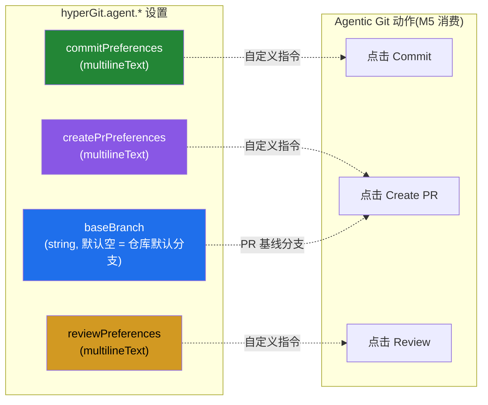

# Agentic Git 偏好配置（Base Branch · Commit / Create PR / Review 指令）

> 为 **Agentic Git**（M5 AI Agent 能力）预置的四项 `hyperGit.agent.*` 配置：一项 **Base Branch**（创建 PR 的基线分支），三项 **偏好指令**——分别在点击 **Commit / Create PR / Review** 时作为自定义指令发送给 agent。三项偏好均内置默认模板（VS Code 多行文本域，未修改即显示默认、可随时编辑或 `Reset Setting` 复位）。
> 本次仅落地「配置项 + 内置默认」；真正消费这些偏好留待 M5 [AI 接缝](../research/05-ai-agent-seams.md) 实装，当前 `agent/` 五接缝仍为 Null、`hyperGit.ai.enabled` 行为不变、零破坏。

## 设计

采用**原生 VS Code 设置**承载（与仓库既有配置一致，零新增 Webview / 命令 / TS）。三项偏好用 `editPresentation: "multilineText"` 渲染为多行文本域，内置默认模板内联于 `package.json` 的 `default`（`.vscodeignore` 排除除 `media/` 外一切、且 VS Code 无「默认取自文件」机制，故默认值必须内联方能在设置界面直接呈现模板）。

## 配置

| 键 | 类型 | 默认 | 说明 |
|---|---|---|---|
| `hyperGit.agent.baseBranch` | `string` | `""` | 创建 PR 时的基线分支；**留空 = 使用仓库默认分支**。 |
| `hyperGit.agent.commitPreferences` | `string`（多行） | 内置 Commit 模板 | 点击 **Commit** 时发送给 agent 的自定义指令。 |
| `hyperGit.agent.createPrPreferences` | `string`（多行） | 内置 Create PR 模板 | 点击 **Create PR** 时发送给 agent 的自定义指令。 |
| `hyperGit.agent.reviewPreferences` | `string`（多行） | 内置 Review 模板 | 点击 **Review** 时发送给 agent 的自定义指令。 |

## 内置默认

- **Commit 模板**：源自中文的提交规约，已**译为专业英文**（Workflow / Notes / Commit Message Convention）；规约本身规定「提交信息用中文」，故示例（`ci(Jenkins): 修改配置文件以支持 staging 环境;`）与签名块**原样保留**以如实演示该规则。
- **Create PR 模板**：**逐字内置**创建 PR 的工作流指令，含占位符 `${YOUR_BRANCH}` / `${TARGET_BRANCH}` / `${PR_TITLE}` / `${PR_DESCRIPTION}` / `#{pr_number}` / `{pr_url}`（运行时由宿主替换），末段用户偏好优先级最高。
- **Review 模板**：**逐字内置**代码评审准则（判定「是否为需上报的 bug」的标准、评论撰写规范、`mcp__conductor__GetWorkspaceDiff` 取 diff 与 `git merge-base origin/${TARGET_BRANCH} HEAD` 兜底、`mcp__conductor__DiffComment` 输出格式）。

## 实现

- 契约：[`package.json`](../../package.json) — `contributes.configuration.properties` 新增四项 `hyperGit.agent.*`（置于 `hyperGit.claudeCode.executablePath` 之后）。
- 无新增命令 / TS / 单测（纯声明式配置；图中仅文本域，Base Branch 为文本输入）。

## 与 Agentic Git 的关系

与 [Claude Code 配置](./claude-code-config.md) 同属 M5 **pre-M5 预置**：仅定义配置与内置默认，不改变现有行为。M5 启动后，Commit / PR / Review 相关接缝将读取对应偏好作为 agent 指令、并以 `baseBranch` 作为 PR 基线。相关设计见 [AI Agent 架构预留](../research/05-ai-agent-seams.md) 与 [实施状态总览](../milestones/implementation-status.md)。

## 验证

1. `node -e "require('./package.json')"` JSON 合法；`contributes.configuration.properties` 计数为 **11**。
2. `pnpm run check-types` + `pnpm run lint` + `pnpm run test:unit` 全绿（无 TS/测试改动，回归 372 用例）。
3. Extension Development Host（F5）：设置搜索 `hyperGit.agent` → 见四项；三项偏好呈**多行文本域并默认显示内置模板**，`Base Branch` 为文本输入；编辑后经齿轮 `Reset Setting` 可复位默认。
