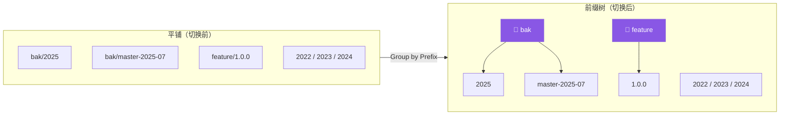
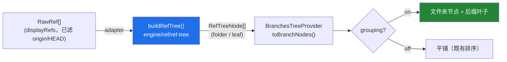

# 分支前缀分组树（Group Branches by Prefix）

> Branches 视图的 **Local / Remote / Tags** 三段支持在**平铺列表**与**按 `/` 前缀分组的文件夹树**之间切换（对齐 VS Code SCM / GitLens 的分支分组）。共享前缀的分支收拢到以前缀命名的可折叠文件夹下，叶子仅显示末段后缀；工具栏一键切换、按仓库记忆偏好，默认树形。**Favorites 段恒平铺**并显示完整短名。

## 效果：扁平 → 前缀树

远程段整体收拢为单个 `origin` 文件夹，内部再嵌 `feature`：`origin/feature/1.0.0` → `origin` → `feature` → `1.0.0`。

## 设计：引擎算树、适配层渲染（单一事实源）

分支前缀分组与「变更文件目录树」（见 [file-list-group-by-directory](./file-list-group-by-directory.md)）是同构问题，故沿用其成熟范式：纯逻辑引擎构树、上层仅渲染。

- **纯逻辑 `buildRefTree`**（[`engine/ref/ref-tree.ts`](../../src/engine/ref/ref-tree.ts)，零 vscode 依赖、Vitest 覆盖）：按 `shortName` 的 `/` 分段建 trie；叶子携带完整 `RawRef`（短名不丢，命令仍以 `ref.shortName` 定位）、`label` 取末段后缀。**分支感知排序**——当前 HEAD（第 0 档）→ 收藏（第 1 档）→ 同档内**文件夹在前**、名称数字感知升序、稳定；**compact 折叠**单目录子链（如 `a/b/c` → `a/b`，遇含叶子或多子目录即停，对齐 VS Code `explorer.compactFolders`）。
- **含 `/` 的远程名无需特判**：fork 场景 remote 名可含 `/`（如 `myorg/repo`），compact 折叠会把 `myorg/repo` 单目录子链渲染为单个文件夹，视觉上与「remote 为一层」等价；删除等**正确性敏感**逻辑仍走 [`resolveRemoteBranch`](../../src/engine/ref/remote-ref.ts) 的最长前缀匹配，两者正交不耦合。
- **隐藏 `origin/HEAD`**：远程符号引用 `refs/remotes/<remote>/HEAD`（短名如 `origin`）非真实分支，视图统一过滤（`isRemoteHead`）——既对齐主流 Git UI，也消除「`origin` 叶子」与分组后「`origin` 文件夹」的同名冲突，远程计数随之归为真实分支数。

## 切换 UI：原生 TreeView 双命令 + context key

Branches 为原生 TreeView（非 webview），切换采用 VS Code 惯用范式：两条互斥命令 + `setContext` 驱动工具栏按钮显隐。

| 状态 | 工具栏按钮 | 命令 | 图标 |
|---|---|---|---|
| 平铺 | 显示「分组」 | `hyperGit.branchesGroupByPrefix` | `$(list-tree)` |
| 树形 | 显示「平铺」 | `hyperGit.branchesFlatten` | `$(list-flat)` |

- context key `hyperGit.branchesGrouping` 由 [`extension.ts`](../../src/extension.ts) 在 `activate` 时按 provider 持久化初值设定，命令翻转时同步更新；`package.json` 的 `view/title` `when` 子句据此互斥显示两按钮。
- 偏好按仓库持久化于 `workspaceState`（键 `hyperGit.branchesGrouping:${repoRoot}`，仿 [`BranchFavorites`](../../src/adapter/branch-favorites.ts)），重启后恢复；文件夹默认展开、点击即折叠/展开，展开态经 `TreeItem.id`（`folder:${group}:${path}`）跨刷新稳定。

## 兼容性（命令零破坏）

文件夹节点使用独立 `contextValue` `hyperGit.branchFolder`，不匹配任何 `view/item/context` 命令 → 无右键菜单；多选批量经 [`selectedBranchRefs`](../../src/adapter/branch-selection.ts) 只保留 `kind === 'branch'`，文件夹节点天然被忽略。checkout / delete / rename / merge / rebase / compare / favorite 等命令均无需改动。

## 实现

- 引擎：[`engine/ref/ref-tree.ts`](../../src/engine/ref/ref-tree.ts)（+ [`tests/unit/ref-tree.test.ts`](../../tests/unit/ref-tree.test.ts)，12 用例）。
- 适配层：[`adapter/tree/branches-tree.ts`](../../src/adapter/tree/branches-tree.ts)（`BranchFolderNode`、`grouping` 状态与持久化、`isRemoteHead` 过滤、`sectionNodes`/`toBranchNodes`、folder 的 `getTreeItem`）。
- 装配 / 贡献点：[`extension.ts`](../../src/extension.ts)（context key + 命令）、[`package.json`](../../package.json)（两命令 + `view/title` 互斥菜单）。

## 验证

`pnpm run test:unit`（含 `ref-tree.test.ts`）全绿；Extension Development Host（F5）：Local/Remote/Tags 在平铺 ⇄ 树间即时切换、刷新后保持；共享前缀收拢为文件夹、叶子仅显示后缀；`origin/HEAD` 不再单列、远程计数为真实分支数；文件夹可折叠、compact 生效；分支右键命令与多选批量均正常，文件夹节点无菜单、被多选忽略。
