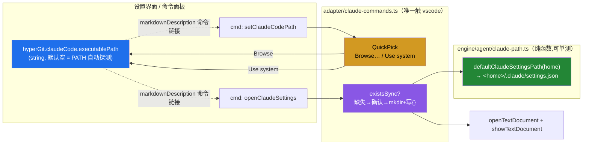

# Claude Code 配置（可执行路径 · Claude 设置快捷入口）

> 为 **Agentic Git**（M5 AI Agent 能力）预置的两项 Claude Code 相关配置：
> **可执行路径**——指定自定义的 Claude Code CLI 二进制（留空则从 `PATH` 自动探测 `claude`）；
> **Claude 设置**——一键打开用户级配置文件 `~/.claude/settings.json`。
> 本次仅落地「配置项 + 快捷入口」；真正的 Claude Code 调用留待 M5 [AI 接缝](../research/05-ai-agent-seams.md) 实装，当前 `agent/` 五接缝仍为 Null 实现、`hyperGit.ai.enabled` 行为不变。

## 效果

- **设置界面**：`设置 → 搜索 hyperGit.claudeCode` 可见「Claude Code executable path」文本框，占位示例 `/opt/homebrew/bin/claude`；描述内嵌两条可点击命令链接（`Browse for executable…` / `Open Claude settings`），在设置页内就地复现「浏览文件夹」与「打开 Claude 设置」两个动作。
- **命令面板**：`Hyper Git: Set Claude Code Executable Path…` 与 `Hyper Git: Open Claude Settings` 亦可直接调用。

## 设计

采用**原生 VS Code 设置 + 命令**承载（与仓库既有 7 项配置一致，零新增 Webview 面板；符合最小干预 / 复用驱动）。路径解析下沉为纯函数（engine 层，可单测），adapter 层仅注入 `os.homedir()` 并触碰 vscode API。

## 配置

| 键 | 类型 | 默认 | 说明 |
|---|---|---|---|
| `hyperGit.claudeCode.executablePath` | `string` | `""` | Agentic Git 使用的 Claude Code CLI 可执行路径；**留空 = 从 `PATH` 自动探测 `claude`（推荐）**。可经 `Set Claude Code Executable Path…` 命令浏览设置或清空。 |

## 命令

| 命令 | 标题 | 行为 |
|---|---|---|
| `hyperGit.setClaudeCodePath` | Set Claude Code Executable Path… | QuickPick：**Browse for executable…**(文件选择器写回设置) / **Use system Claude Code**(清空覆盖，回退 `PATH` 自动探测)。 |
| `hyperGit.openClaudeSettings` | Open Claude Settings | 打开 `~/.claude/settings.json`；**文件不存在时经用户确认后创建**（`mkdir -p` + 写入 `{}`），随后在编辑器打开。 |

## 实现

- 纯逻辑（Vitest 可测）：[`engine/agent/claude-path.ts`](../../src/engine/agent/claude-path.ts) — `defaultClaudeSettingsPath(home)` 跨平台拼接路径（`home` 由调用方注入，函数确定性）。
- 适配层（唯一触 vscode）：[`adapter/claude-commands.ts`](../../src/adapter/claude-commands.ts) — `registerClaudeCommands()`，复用 `misc-commands.ts` 的 `showOpenDialog` / `openTextDocument` / 错误处理范式。
- 装配：[`extension.ts`](../../src/extension.ts) — 命令注册块追加 `...registerClaudeCommands()`。
- 契约：[`package.json`](../../package.json) — `contributes.configuration`（新增设置项）+ `contributes.commands`（两条命令）。
- 测试：[`tests/unit/claude-path.test.ts`](../../tests/unit/claude-path.test.ts)。

## 与 Agentic Git 的关系

本特性是 M5 的**预置铺垫（pre-M5 groundwork）**：仅提供配置与快捷入口，不改变现有行为——`agent/` 五接缝（`ILlmProvider` 等）仍 Null 实现、`hyperGit.ai.enabled` 仍仅占位。待 M5 启动，`ILlmProvider` / 提交信息生成等接缝将读取 `hyperGit.claudeCode.executablePath` 定位 CLI 并实装真实能力。相关设计见 [AI Agent 架构预留](../research/05-ai-agent-seams.md) 与 [实施状态总览](../milestones/implementation-status.md)。

## 验证

1. `pnpm run check-types` + `pnpm run lint` + `pnpm run test:unit`（含 `tests/unit/claude-path.test.ts`）全绿。
2. Extension Development Host（F5）：
   - `设置` 搜索 `hyperGit.claudeCode` → 见新设置及两条内嵌命令链接；点击 `Browse…` 弹文件选择、点击 `Open Claude settings` 可跳转。
   - 命令面板 `Set Claude Code Executable Path…` → Browse 写入路径 / Use system 清空，设置值随之变化。
   - 命令面板 `Open Claude Settings`：文件已存在→直接打开；不存在→确认后创建 `{}` 并打开；取消则不创建。
