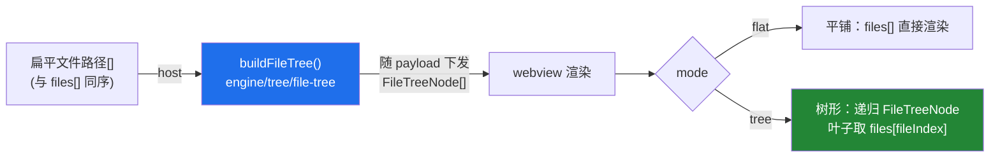

# 变更文件目录树切换（Group by Directory）

> Commit 视图活动 Changelist 的文件列表、Log 视图选中提交的「Changed Files」列表，均支持在**平铺列表**与**按目录分组的树形**之间切换（对齐 IntelliJ / VS Code SCM）。默认平铺，树形为可选切换，偏好按视图各自记忆。

## 设计：host 算树、webview 渲染（单一事实源）

Webview 使用内联 `<script>` 字符串，无法 `import` engine TS。为避免同一「路径→树」逻辑两处实现（Split-Brain），沿用提交图布局的成熟范式（`graph-layout` 于 host 计算、随 `GraphRowVM.layout` 下发）：

- **视图无关的 `FileTreeNode`**（[`shared/protocol.ts`](../../src/shared/protocol.ts)）：目录带 `name/path/children`，叶子带 `fileIndex` 回指扁平 `files[]`。同一套渲染逻辑服务两视图，且不复制条目数据。
- **构建算法**（[`engine/tree/file-tree.ts`](../../src/engine/tree/file-tree.ts)，纯逻辑、Vitest 覆盖）：`/` 分段建 trie；每级**目录在前、文件在后**，同类按名称数字感知升序、稳定（相等按插入序）；**compact 折叠**单目录子链（如 `a/b/c` → `a/b`，遇含叶子或多子目录即停，对齐 VS Code `explorer.compactFolders` 默认开启）；根级文件、同名异目录、空输入、重复路径（keep-first）均已覆盖。
- **切换零 host 往返**：平铺 `files[]` 与树 `tree[]` 同批下发，切换/折叠仅本地重渲。

## 两视图差异

| | Commit 视图 | Log 视图（详情面板） |
|---|---|---|
| 数据源 | 活动 Changelist 的 `CommitFileItem[]` | 选中提交 `diff-tree` 的 `LogCommitFileItem[]` |
| 建树路径 | 条目 `path`（仓库相对） | `CommitFileChange.path`（干净新路径，重命名归位到新目录） |
| 复选框 | 有：叶子勾选 + **目录三态**级联；Select All 基于全量文件 | 无（只读浏览） |
| 叶子单击 | 打开 Diff（`commit/openFile`） | 打开单文件 Diff（`log/openFile`，`data-path` 保持展示串不变） |
| 偏好持久化 | `setState({mode, collapsed, checked})` | `setState({dmode, dcollapsed, ...})` |

## 实现

- 引擎：[`engine/tree/file-tree.ts`](../../src/engine/tree/file-tree.ts)（+ [`tests/unit/file-tree.test.ts`](../../tests/unit/file-tree.test.ts)，15 用例）。
- 协议：[`shared/protocol.ts`](../../src/shared/protocol.ts)（`FileTreeNode`；`CommitViewState.tree`；`log/commitFiles` payload `tree`）。
- 渲染：[`commit-webview.ts`](../../src/adapter/webview/commit-webview.ts)（List/Tree 段控、`renderFlat`/`renderTree`、`makeLeafRow`、目录三态 `updateDirStates`）、[`log-webview.ts`](../../src/adapter/webview/log-webview.ts)（`renderDetails` 分派、`renderDetailNode`）。

## 验证

`pnpm run test:unit`（含 `file-tree.test.ts`）全绿；Extension Development Host（F5）：两视图 List/Tree 即时切换、刷新/切换提交后保持模式；树内目录可折叠、compact 生效；Commit 目录三态与 Select All 联动正确；树形叶子单击仍打开对应文件 Diff（含重命名项）。
