# Log 视图 CI 状态（GitHub Actions / Commit Status）

> 在 Log 视图（`hyperGit.log`，可视化提交图）每条提交上显示其 **CI 最终状态**：绿勾=通过、红叉=失败、
> 运行中=黄色旋转；悬停图标以浮层 Tooltip 展示「各项检查 + 未通过原因 + 运行链接」。
> 数据源为 GitHub（Checks API + Commit Status），按 origin 远程主机自动判定 github.com / GitHub Enterprise。

## 数据流

```mermaid
flowchart LR
  subgraph Git["本地"]
    A["git log → GraphRowVM"] --> B["图先渲染（CI 不阻塞）"]
  end
  subgraph WV["Webview（可见行懒加载）"]
    B --> C["滚动收集未知 hash"]
    C -->|"防抖 200ms"| D["log/requestCi"]
  end
  subgraph Host["Extension Host"]
    D --> E["解析 origin 远程\nowner/repo/host"]
    E --> F["vscode.authentication\n取 token（repo 范围）"]
    F --> G["GraphQL 批量 ≤100 oid\nstatusCheckRollup"]
    G --> H["按 oid 缓存\n终态永久 / pending 30s"]
  end
  H -->|"log/ciData"| I["webview 就地重绘图标"]
  I --> J["悬停 → Tooltip 明细"]
  J -->|"log/openExternal"| K["host 校验主机后\nopenExternal"]
  style A fill:#1f6feb,color:#fff
  style G fill:#238636,color:#fff
  style H fill:#8957e5,color:#fff
  style J fill:#d29922,color:#fff
```

## 认证与安全

- 复用 **VS Code 内置 GitHub 认证**（`vscode.authentication`），凭证由编辑器托管，**绝不经过 chat / 日志 / webview**。
- 范围 `repo`：覆盖私有仓库的 Checks（Actions）+ Commit Status 读取（`repo:status` 不覆盖 Checks API）。
- **静默优先**：加载时 `getSession({createIfNone:false})` 仅复用已有会话，**绝不自动弹窗**；仅当用户点击工具栏「登录 GitHub」
  按钮时才以 `{createIfNone:true}` 触发原生授权 UI。未登录 → 显示登录提示、不渲染图标、不发请求。
- **反 SSRF**：Tooltip 的跳转链接（`detailsUrl` / `targetUrl`，属「观察内容」）由 host 校验 `https` 且主机 ∈ {仓库主机、`*.github.com`} 后才 `openExternal`。

## 限流与性能

- **懒加载、仅取可见行**：webview 虚拟滚动只渲染 ~50 行，滚动时收集未知 hash（防抖 200ms）批量请求。1000 条提交永不触发 1000 次请求。
- **批量 GraphQL**：单次最多 100 个 oid 的 `statusCheckRollup`（别名批量），并发上限 2。
- **缓存**：终态（success/failure）整会话缓存（提交 CI 结果不可变）；pending/unknown 30s TTL，运行中构建会逐步刷新为终态。
- **限流冷却**：读取响应 `rateLimit{remaining,resetAt}` 与 `Retry-After`；剩余点数 <100 或 403 时进入冷却，期间只走缓存并给出一次性提示。
- **降级**：未推送提交（远程无此 object）/ 无 CI 配置 → 不渲染图标；网络错误不缓存、下次滚动重试；断网/限流不崩溃、建图正常。

## 边界行为

| 场景 | 表现 |
|---|---|
| 未推送 / 本地提交 | 无图标（远程无对应 object → unknown） |
| 仓库无 CI 配置 | 无图标（rollup 为 null → unknown） |
| 非 GitHub 远程（GitLab 等） | 功能隐藏（零图标、零请求） |
| GitHub Enterprise | 按 origin 主机自动判定，使用 `github-enterprise` provider（需用户已配置 `github-enterprise.uri`） |
| 窄屏（.narrow 隐藏 author/date） | CI 图标例外保留可见 |

## 配置

| 键 | 默认 | 说明 |
|---|---|---|
| `hyperGit.log.ci.enabled` | `true` | 总开关。关闭后零图标、零请求。 |
| `hyperGit.log.ci.remote` | `""` | 查询用的远程名；留空=自动（优先 `origin`），多远程可指定如 `upstream`。 |
| `hyperGit.log.ci.provider` | `auto` | `auto`（按主机判定）/ `github.com` / `github-enterprise`。 |

## 实现

- 引擎层（纯逻辑，Vitest 可测）：[`engine/ci/`](../../src/engine/ci) — `remote-parser.ts`（URL→坐标/端点）、`graphql-query.ts`（批量查询构造）、`rollup.ts`（状态归一化/聚合）、`model.ts`（响应解析）、`types.ts`。
- 适配层（唯一触碰 vscode/网络）：[`adapter/ci/`](../../src/adapter/ci) — `github-auth.ts`（认证）、`github-ci-service.ts`（缓存/批量/限流/降级/openExternal）。
- 协议：[`shared/protocol.ts`](../../src/shared/protocol.ts) — `log/requestCi`、`log/ciData`、`log/ciMeta`、`log/openExternal`、`log/ciSignIn`。
- 渲染：[`adapter/webview/log-webview.ts`](../../src/adapter/webview/log-webview.ts) — 内联 JS 的懒加载、图标槽位（提交行最右侧）、自定义 Tooltip 浮层。

## 验证

1. `pnpm run check-types` + `pnpm run lint` + `pnpm run test:unit`（含 `tests/unit/ci-*.test.ts`）全绿。
2. Extension Development Host（F5）在 GitHub 仓库：未登录见「登录 GitHub」提示 → 点击原生授权 → 可见行右侧渐次出现图标；悬停红叉见明细 + 链接；点击打开 run；未推送/非 GitHub → 无图标；断网/限流不崩溃。
