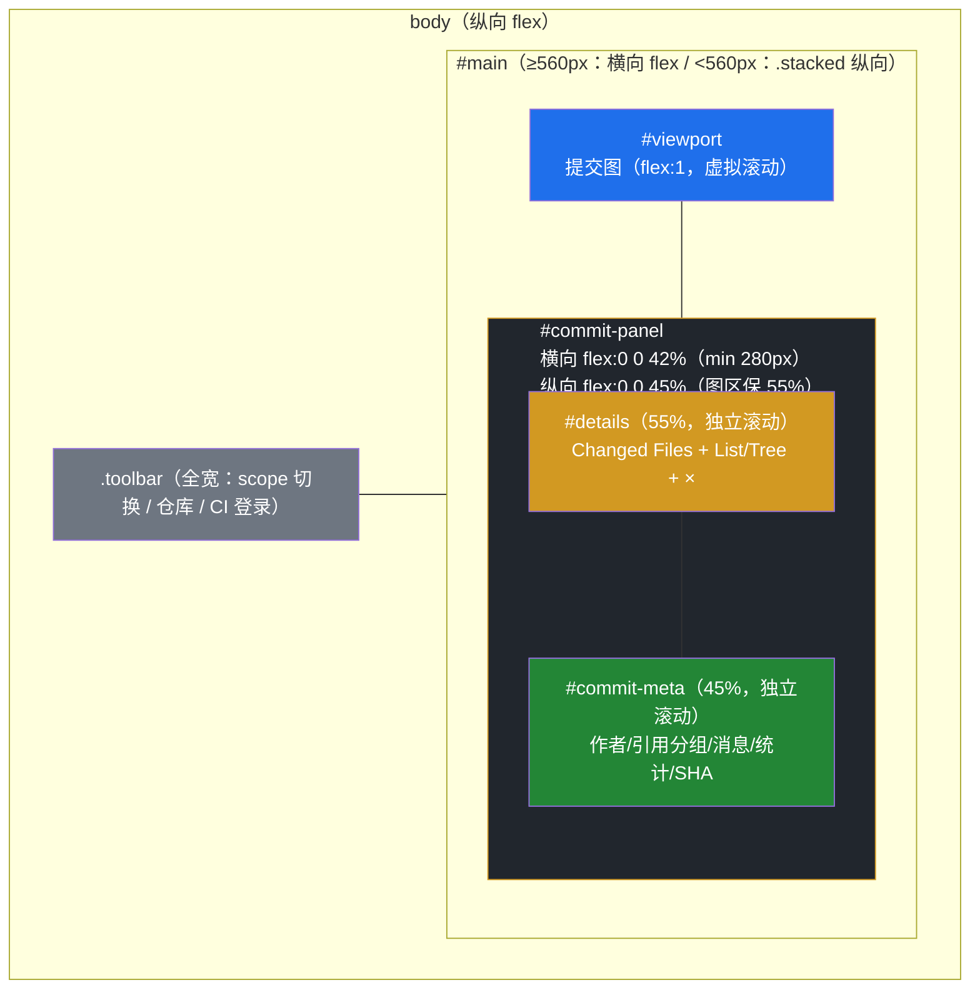
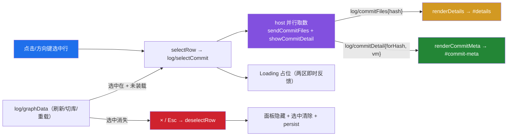

# Log 提交详情面板（Commit Detail Panel）

> 点击 Log 视图任一提交行，在**图右侧**于 webview 内水平分栏打开常驻详情面板：上半区 **Changed Files**（List ⇄ Tree 切换、点击打开 Diff），下半区**提交信息**——作者（`name <email>`）+ 时间（绝对 + 相对）、**HEAD / 本地分支 / 远程分支 / 标签**引用分组、完整消息（subject + body）、（与作者不同时的）提交者、变更统计、完整 SHA、Open on GitHub。**面板可见性 ⟺ 选中态**：`×` 或 `Esc` 取消选中即收起，未选中自动隐藏。原悬停浮层（`#commit-tip`）与 `i` 快捷键整体移除。

## 布局与定位

VS Code 的 panel 视图容器（`hyper-git`）内多视图只能**垂直堆叠**，无法原生并排两个子视图；编辑器区 `WebviewPanel` 方案亦曾实验后回退。故「右侧平级视窗」落地为 **Graph webview 内部左右分栏**（对齐 Git Graph 扩展的 Details 列形态）：

- **可见性不变式**：`#commit-panel.show` ⟺ `selectedHash !== null`。所有路径经三个漏斗收敛——`requestPanelData(hash)`（开面板 + Loading）、`deselectRow()`（收面板 + 清选中 + 焦点回落图区）、`log/graphData` 的恢复/消失分支。`deselectRow()` 的幂等守卫**同时校验选中态与面板可见性**：`graphData` 解析出「无选中」（如切到无记忆选中的仓库）时 `selectedHash` 本已为 `null`，仅按选中态早退会把上一仓库的面板连内容一起留在原地。
- **窄视口降级**：面板 `min-width: 280px` 不可收缩，横向并排会把 `#viewport` 挤至零宽（`flex: 1` + `min-width: 0`）。故 `#main` 宽度 < 560px 时切 `.stacked` 退化为上下堆叠（面板 45%，图区保 55%）——观察 `#main` 而非 `#viewport`，因后者宽度随面板开合变化会形成「开面板→变窄→堆叠→变宽」反馈环。面板开合引起的 `#viewport` 宽度变化仍由既有 `ResizeObserver` 切 `.narrow`（隐 author/date、留 CI 列）。

## 交互与数据流

- **一次选中、两路并行**：host `log/selectCommit` 分支同时发起变更文件与详情取数，均沿用 `rootAtStart` 切库竞态守卫（issue #107）。
- **过期回包丢弃**：`log/commitFiles` 按 `hash`、`log/commitDetail` 按 **`forHash`** 回显校验——失败回包 `vm=null` 无 hash 可比对，`forHash` 补齐该盲区，杜绝迟到失败在新选中下闪现占位。
- **失败非静默**：详情取数失败显示 "Details unavailable" 占位；同 hash 重点击放行重试（`metaFailHash` 例外）。
- **同 hash 重点击防抖**：不重拉防闪烁；方向键导航每次必换 hash，不受影响。
- **刷新语义**：提交对象不可变——文件不重拉；`meta` 按新行集重渲（新推分支/标签等引用 chips 变化即时反映）。
- **重载恢复**：选中 hash 本就按仓库持久化（state v2），`graphData` 到达且选中行存在时补拉面板数据，实现跨重载/切库恢复。
- **XSS 安全**：分支名/标签/作者/正文等一切外部内容均经 `esc()` 转义后注入。

## 边缘 Case

| Case | 行为 |
|---|---|
| 快速连点 A→B→C | 每击即显新 hash Loading；过期回包按 `hash`/`forHash` 丢弃 |
| 取数途中切库 | host 竞态守卫 + `forHash` 丢弃；新库 `graphData` 恢复其记忆选中 |
| 选中期间 git 刷新 | 面板保持，文件不重拉，引用分组按新行集重渲 |
| 根提交 / merge | "No changed files (may be a root or merge commit)" 占位 + 详情正常 |
| CI 图标 | 点击不选行、CI 浮层原样（原互斥代码随浮层一并消失） |
| 非 GitHub 远程 | 无 Open on GitHub 链接（host 不下发 `githubUrl`） |
| 键盘 | 方向键/Home/End 移动选中即更新面板；`Enter` 菜单、右键菜单原样；`Esc` 取消选中 |
| 切到无记忆选中的仓库 | 面板收起并清空（不残留上一仓库的文件列表 / 详情，杜绝旧 hash 误发 `log/openFile`） |
| 视图窄于 560px | `.stacked` 上下堆叠，图区恒占满宽、不被面板压缩；`≥560px` 恢复左右分栏 |

## 实现

- 面板与漏斗：[`adapter/webview/log-webview.ts`](../../src/adapter/webview/log-webview.ts)（`#main`/`#commit-panel` 分栏、`selectRow`/`requestPanelData`/`deselectRow`、`renderCommitMeta`、Loading 占位、消息守卫）。
- 协议：[`shared/protocol.ts`](../../src/shared/protocol.ts)（`log/commitDetail` 增 `forHash`；移除 `log/showCommitDetail` 与编辑器区面板遗留死类型）。
- 复用：[`engine/tree/file-tree.ts`](../../src/engine/tree/file-tree.ts)（目录树）、[`engine/log/commit-files.ts`](../../src/engine/log/commit-files.ts)（name-status 解析）、[`engine/ci/remote-parser.ts`](../../src/engine/ci/remote-parser.ts)（GitHub URL）、`log/openFile` → `hyperGit.openCommitFileDiff` Diff 链路不变。

## 验证

`pnpm run compile` + `pnpm run test:unit` 全绿；Extension Development Host（F5）：点击行开面板（Loading → 文件计数 + 详情）、行悬停无浮层、CI 浮层鼠标/键盘均可用、文件点击开 Diff、List/Tree 切换、同 hash 重点击无闪烁、`×`/`Esc` 收起且方向键仍可用、快速连点终态正确、选中态下 commit 后面板保持且 chips 更新、切分支选中消失自动收起、切库/重载恢复、根/merge 占位、窄面板自适应。

分栏与状态机另经**离屏夹具实测**（抽取本文件真实 CSS + webview 脚本、桩掉 `acquireVsCodeApi` 后在浏览器中量测）：

| 视图宽度 | 降级前图区宽 | 降级后 |
|---|---|---|
| 1200px | 696px | 左右分栏，图区 696px |
| 640px | 360px | 左右分栏，图区 360px |
| 560px | 280px | 左右分栏，图区 280px（阈值边界） |
| 480px | 200px | `.stacked`，图区 480px |
| 320px | 40px | `.stacked`，图区 320px |
| 280px | **0px** | `.stacked`，图区 280px |

状态机六步序列（repo1 选中 → 切 repo2 无记忆选中 → 迟到 `vm=null` 回包 → 切回 repo1 → `×` 取消 → 重复取消）全部命中预期：面板可见性与 `selectedHash` 始终同步，重复 `deselectRow()` 零额外 `postMessage`，横向无溢出（`scrollWidth - clientWidth === 0`）。

## 展望

- 面板宽度拖拽分隔条（现横向 42% + 280px 下限、纵向 45%，560px 处自动降级，YAGNI 暂缓）。
- 详情区随 `host` 防抖合并（方向键连续导航时减少单提交 `git` 调用，现为每停 2 次，毫秒级可接受）。
