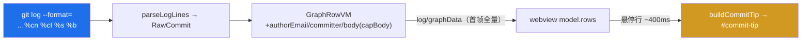

# Log 提交悬浮详情（Commit Tooltip）

> 鼠标悬停 Log 视图任一提交行，以浮层快速展示该提交的完整信息：所在**本地/远程分支、标签、HEAD**、**完整提交消息**（subject + body）、**作者**（`name <email>`）、（与作者不同时的）**提交者**、**作者/提交时间**（绝对 + 相对）、**完整 SHA**。

## 数据流与取数

引用标签（分支/标签/HEAD）本就随 `GraphRowVM.chips` 下发；本特性补齐正文与提交者，随首帧一并送达，故悬停**零往返、零延迟**。

- **格式扩展**（[`engine/log/log-line.ts`](../../src/engine/log/log-line.ts)）：`LOG_GRAPH_FORMAT` 增 `%cn`（提交者）、`%cI`（提交时间）、`%b`（正文）。`%b` **置于末字段**：记录以 RS `%x1e` 终止、字段以 NUL `%x00` 分隔，二者不出现于 git 文本，故正文内换行/管道/反斜杠不被误判为边界；解析用 `slice(8).join(NUL)` 稳健重组末字段。
- **payload 控制**：正文 host 侧 `capBody` 截断至上限（超限省略号、裁尾空白），避免 1000 行图的 `postMessage` 膨胀；浮层内另设滚动区兜底长正文。

## 复用 CI 浮层范式

沿用既有 CI 状态浮层（`#ci-tip`）的自定义浮层设计，新增 `#commit-tip`：

- **置于 `#rows` 之外**：虚拟滚动重写行 DOM 时浮层不被销毁。
- **与 CI 浮层互斥**：悬停 `.ci` 图标只显 CI 浮层（提交浮层隐藏并取消在途显示）；悬停行其余区域显提交浮层（显示前先 `hideTip()` 关 CI 浮层）。
- **延迟与消隐**：悬停 ~400ms 显、离开 ~200ms 隐；滚动、`log/graphData`（刷新/切范围）、`log/ciMeta`、`log/appendData`（整体重绘 `#rows`）均即时消隐并取消在途显示（避免对已脱离节点定位）。
- **键盘可达**：选中行按 `i` 打开、`Esc` 关闭（`stopPropagation` 避与 `Enter`→提交菜单冲突）。
- **无双重气泡**：移除提交行 chips 的原生 `title`，引用明细统一由本浮层展示。
- **XSS 安全**：分支名/标签/作者/正文等一切外部内容均经 `esc()` 转义后注入。

## 实现

- 数据：[`engine/log/log-line.ts`](../../src/engine/log/log-line.ts)（格式 + `RawCommit` + 解析；[`tests/unit/log-line.test.ts`](../../tests/unit/log-line.test.ts)/[`log-query.test.ts`](../../tests/unit/log-query.test.ts) 更新含多行/空正文/提交者异于作者用例）。
- 协议：[`shared/protocol.ts`](../../src/shared/protocol.ts)（`GraphRowVM` 增 `authorEmail/committerName/committerDate/body`）。
- 浮层：[`adapter/webview/log-webview.ts`](../../src/adapter/webview/log-webview.ts)（`#commit-tip` + `buildCommitTip`/`positionCommitTip`/`scheduleShowCommit`/`hideCommitTip`、行 hover 处理、`fmtAbs`/`fmtRel`）。

## 验证

`pnpm run test:unit` 全绿；Extension Development Host（F5）：悬停提交行 ~400ms 出浮层含各引用组 + 消息（多行保留、超长滚动 + 截断）+ 作者/提交者/时间/完整 SHA；悬停 CI 图标只出 CI 浮层（互斥）；chips 无原生气泡；滚动/切换范围/刷新自动消隐；`i` 开 `Esc` 关且不误触菜单；合并 / 无正文 / detached HEAD / 多引用均正常。
