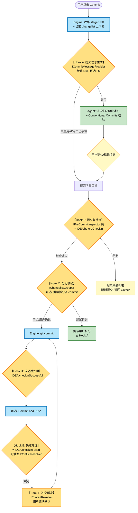

# Track5:AI Agent 架构预留设计报告(Hyper Git)

> 调研截至 2026/06/27。所有事实论断附来源(GitHub 路径/官方文档 URL)。不确定处标注"待核实"。
> 核心立场:本扩展提供 **完整的 Git 变更管理与提交工作流**。VS Code 内置 Copilot **已有**提交信息生成能力([VS Code 官方介绍](https://code.visualstudio.com/docs/sourcecontrol/overview)),因此我们的 AI 层必须做"差异化与可组合性",而非重复造轮子——这契合 AGENTS.md 的"复用驱动"与"正交分解"。

---

## 1. AI 落地场景清单(git/commit 环节)

按"价值 × 难度 × 与 VS Code 内置能力的差异化"三维度评估。

| # | 场景 | 输入 | 输出 | 价值 | 难度 | 推荐落地机制 |
|---|------|------|------|------|------|------|
| 1 | **AI 提交信息生成** | staged diff(可含历史 commit 风格、团队 Conventional Commits 规范、本次 changelist 分组意图) | 符合规范的单行 subject + 多行 body,流式输出 | 高 | 低 | Language Model API(`vscode.lm`)+ prompt-tsx;触发位为 SCM `inputBox` 旁的 ✨ 生成按钮 |
| 2 | **提交前 AI 代码审查(本地 PR review)** | staged 文件 + diff + 仓库上下文(相关符号/调用方) | 问题列表(严重度、文件:行、建议修复),可阻断或放行 commit | 极高 | 中 | Language Model API + Chat Tools(供 Agent 调用 `read_file`/`grep_symbols`);**借鉴 JetBrains `CheckinHandler.beforeCheckin` 提交前检查语义** |
| 3 | **AI 变更语义分组(自动 changelist 归类)** | Local Changes 全部变更文件 + diff 摘要 | 建议的 changelist 分组(如 "feature-A 相关"、"重构"、"配置"),支持一键应用 | 高 | 中 | Language Model API(聚类式 prompt);结果写回 changelist 模型(本扩展自管的分组数据结构) |
| 4 | **AI 冲突解决助手** | merge conflict 文件(ours/theirs/base 三方) | 建议的合并结果 + 解释,可逐块采纳 | 高 | 高 | Language Model API(三方 diff prompt)+ inline diff 预览;**注意:需用户确认,不可自动写入**(参考 VS Code 工具确认机制 [`prepareInvocation`](https://code.visualstudio.com/api/extension-guides/ai/tools)) |
| 5 | **AI Release Notes / Changelog** | 区间内的 commit 列表 + tag 范围 | 面向用户的 release notes(markdown) | 中 | 低 | Language Model API + prompt-tsx;接入 Log 视图的"生成 changelog"动作 |
| 6 | **AI Blame 解释** | 某行/某块的 commit history(blame 输出) | 该变更的业务意图解释、是否为热修/回退关联 | 中 | 中 | Chat Participant(`@sofia-git`)+ Chat Tools(`git_blame`/`git_show`) |
| 7 | **AI Commit 摘要搜索**(Log 增强) | 自然语言查询("上周修复登录 bug 的提交") | 匹配的 commit 列表 | 中 | 中 | Chat Participant + Chat Tools;复用 Log 过滤管道 |

**差异化设计要点**(对齐"复用驱动"):
- VS Code 内置 Copilot 仅做场景 1 的"通用版",**无团队规范注入、无 changelist 分组上下文、无本地代码审查阻断能力**。我们的差异化 = **把 commit 流程的完整上下文(changelist/staged 状态/团队规范)作为 prompt 上下文**,并把 AI 结果**回写到 IDE 工作流**(分组直接落到 changelist 树、审查阻断 commit 按钮),这是内置 Copilot 做不到的。
- 业界实践佐证差异化方向:GitLens 已支持 AI commit message 生成(OpenAI/Anthropic/Gemini 多 provider)[GitLens Discussion #2581](https://github.com/gitkraken/vscode-gitlens/discussions/2581);Microsoft 官方建议 subject ≤ 50 字符、body ≤ 2 句、遵循 Conventional Commits([VS 官方博客](https://devblogs.microsoft.com/visualstudio/customize-your-ai-generated-git-commit-messages/));CodeRabbit 已有"semantic diffs that group related code movement"(场景 3 的先例)[CodeRabbit docs](https://docs.coderabbit.ai/changelog);AI 冲突解决在业界仍是"emerging niche",差异化机会最大([前述搜索结论](https://code.visualstudio.com/api/extension-guides/ai/tools))。

---

## 2. VS Code AI 官方机制能力地图(2026 现状)

### 2.1 Language Model API(`vscode.lm`)——**底层模型访问,所有 AI 场景的基础**
- **核心 API**:`vscode.lm.selectChatModels({vendor, id, family, version})` 返回 `LanguageModelChat[]`;`model.sendRequest(messages, options, token)` 返回流式 `LanguageModelChatResponse`([LM API 官方文档](https://code.visualstudio.com/api/extension-guides/ai/language-model))。
- **关键约束**:
  - **不支持 system message**,仅 User/Assistant 两种消息([同上](https://code.visualstudio.com/api/extension-guides/ai/language-model))——persona/规则必须放在第一条 User message。
  - Copilot 模型**需用户同意(consent)**,以认证对话框形式呈现,故 `selectChatModels` **必须在用户主动触发的动作(如命令)中调用**([同上](https://code.visualstudio.com/api/extension-guides/ai/language-model))。
  - 模型列表会变(gpt-4o/claude-3.5-sonnet 等),必须**防御式编程**:无匹配模型时 `selectChatModels` 返回空数组,需优雅降级([同上](https://code.visualstudio.com/api/extension-guides/ai/language-model))。
  - **限流**:VS Code 对每个扩展的请求数透明计量并影响用户配额;**不得用于集成测试**([同上](https://code.visualstudio.com/api/extension-guides/ai/language-model))。
  - 推理非确定性,可单测的部分是"prompt 构造 + 响应解析"这一**确定性层**,模型交互层不可单测([同上](https://code.visualstudio.com/api/extension-guides/ai/language-model))。

### 2.2 Chat Participant API(`@sofia-git`)——**对话式入口**
- 注册 `vscode.chat.createChatParticipant(id, handler)`,实现 `ChatRequestHandler`;通过 `ChatContext` 获取 `history`/`prompt`,用 `ChatResponseStream` 流式返回 markdown/按钮/进度/文件树([Chat Participant 官方文档](https://code.visualstudio.com/api/extension-guides/ai/chat),[教程](https://code.visualstudio.com/api/extension-guides/ai/chat-tutorial))。
- **适用场景**:场景 6(AI Blame 解释)、7(自然语言搜 commit)等"用户提问式"交互;**不适合**提交信息生成(那是单向生成,不是对话)。
- 推荐:作为 `@sofia-git` 领域专家,而非通用 chat。

### 2.3 Language Model Tools API(Chat Tools)——**让 AI 调用我们的 git 能力**
- 在 `package.json` 的 `contributes.languageModelTools` 声明工具,代码中 `vscode.lm.registerTool(name, instance)`,实现 `prepareInvocation`(确认)+ `invoke`(执行)([Tools 官方文档](https://code.visualstudio.com/api/extension-guides/ai/tools))。
- **适用场景**:场景 2(审查需读文件/查符号)、6(blame 需调 git)。例如注册 `sofia_git_blame`、`sofia_get_staged_diff`、`sofia_read_file` 工具,让 Agent 自主调用。
- **关键价值**:把本扩展的 git 能力(Engine 层)**暴露给任意 Agent**(内置 Copilot Agent、MCP Agent、第三方),实现"可组合性"——这是 Git 变更管理主线工作流之外的核心增值点。
- 工具名规范 `{verb}_{noun}`,参数名 `{noun}`;`canBeReferencedInPrompt: true` 让用户用 `#` 引用([同上](https://code.visualstudio.com/api/extension-guides/ai/tools))。
- 官方建议:工具会执行有副作用操作时,`prepareInvocation` 必须给用户**确认消息**([同上](https://code.visualstudio.com/api/extension-guides/ai/tools))——**这是 AI 冲突解决不可自动写入的安全依据**。

### 2.4 prompt-tsx(`@vscode/prompt-tsx`)——**prompt 的结构化编排**
- 用 TSX 声明 prompt,支持按模型上下文窗口**动态裁剪**、工具结果(`prompt-tsx-parts`)回填、`@vscode/prompt-tsx-elements` 复用元素([prompt-tsx 官方文档](https://code.visualstudio.com/api/extension-guides/ai/prompt-tsx),[GitHub microsoft/vscode-prompt-tsx](https://github.com/microsoft/vscode-prompt-tsx),npm `0.4.0-alpha.x` — alpha,待核实稳定性)。
- **适用场景**:复杂 prompt(提交信息生成含团队规范 + diff + 历史风格;审查含代码上下文)。**当前版本为 alpha,生产需谨慎评估**。

### 2.5 Language Model Chat Provider API(BYOK)——**模型来源可切换的关键**
- `vscode.lm.registerLanguageModelChatProvider(vendor, provider)`,provider 实现 `provideLanguageModelChatInformation`(模型发现)+ `provideLanguageModelChatResponse`(流式响应)+ `provideTokenCount`(token 计数)([LM Chat Provider 官方文档](https://code.visualstudio.com/api/extension-guides/ai/language-model-chat-provider))。
- BYOK 自 2025/03 首发,2025/10 v1.104 扩展为 Provider API,支持 Ollama(本地)/OpenRouter/OpenAI 等([BYOK 官方博客](https://code.visualstudio.com/blogs/2025/10/22/bring-your-own-key))。
- **Copilot Business/Enterprise 管理员可禁用 BYOK 策略**([同上](https://code.visualstudio.com/api/extension-guides/ai/language-model-chat-provider))——企业部署需考虑。

### 2.6 关键事实:VS Code 内置 Copilot 已有 commit message 生成
- SCM 输入框旁的 ✨ 图标,分析 staged diff + 历史 commit 风格生成([VS Code overview](https://code.visualstudio.com/docs/sourcecontrol/overview),[community discussion #51577](https://github.com/orgs/community/discussions/51577))。**这是我们必须差异化的对手,也是可共存的伙伴**。
- Claude Code 扩展已有 issue 请求支持 SCM "Generate Commit Message" provider([claude-code issue #70673](https://github.com/anthropics/claude-code/issues/70673))——说明业界在往"provider 注册"方向收敛。

---

## 3. 当前架构必须预留的"接缝(seam)"

### 3.1 分层归属总览(对齐 AGENTS.md 的 Engine/Adapter/Agent/UI 正交分解)

| 层 | 职责 | AI 相关接缝 |
|----|------|------------|
| **Engine** | 纯 git 领域逻辑(diff/commit/blame 的纯函数,无 VS Code 依赖) | 无 AI,但**必须暴露稳定的领域 DTO**(StagedDiff / CommitResult / ConflictHunk)供 Agent 层消费 |
| **Adapter** | VS Code 平台适配(SCM API 包装、LM API 包装、文件系统) | **ILlmProvider**(封装模型来源切换)、**IChatToolRegistry**(注册工具) |
| **Agent** | AI 能力实现(各 AI 场景的 provider) | **ICommitMessageProvider / IPreCommitInspector / IChangelistGrouper / IConflictResolver** |
| **UI** | Webview/命令交互 | AI 触发入口(按钮/命令)、结果渲染、确认对话框 |

### 3.2 接缝契约(中文伪接口描述)

**接缝 1:ILlmProvider(模型来源抽象,Adapter 层)——最关键的接缝**
```
接口 ILlmProvider:
  方法 selectModel(偏好: 模型偏好): Promise<模型句柄 | 空>
    // 偏好含: 来源优先级[vscodeLM, byokOllama, 自带Key/OpenAI兼容, 本地回退]
  方法 stream(messages: 消息[], 取消令牌): AsyncIterable<文本片段 | 工具调用>
  方法 countTokens(text): Promise<number>
  属性 来源标识: 字符串  // 用于 UI 显示当前用哪个模型
  属性 可用性: 'ok' | '未授权' | '无限流' | '无可用模型'
```
**实现策略**:
- `VscodeLmProvider`:封装 `vscode.lm.selectChatModels`([LM API](https://code.visualstudio.com/api/extension-guides/ai/language-model))。
- `ByokProvider`:基于 `registerLanguageModelChatProvider` 或消费他人注册的 provider([Provider API](https://code.visualstudio.com/api/extension-guides/ai/language-model-chat-provider))。
- `OpenAiCompatibleProvider`:直连 OpenAI 兼容端点([BYOK 博客提到 OpenAI Compatible provider](https://code.visualstudio.com/blogs/2025/10/22/bring-your-own-key))。
- **为何现在就抽**:模型来源是"未来切换/企业本地化/避免云端强依赖"的命脉。若现在硬编码 `vscode.lm`,未来接 Ollama/自带 key 需大面积重构。这是"防患于未然"而非 YAGNI 反例——因为**契约本身不引入任何 AI 依赖**,只是约束调用边界。

**接缝 2:ICommitMessageProvider(Agent 层)**
```
接口 ICommitMessageProvider:
  方法 generate(输入: { stagedDiff, 历史风格样本, 团队规范, 当前changelist分组 }, 
                流式回调: (片段) => void, 取消令牌): Promise<{ 消息, 置信度 }>
  方法 validate(消息, 规范): { 合法: bool, 违规项: [] }  // Conventional Commits 校验
```
- 默认实现:`NullCommitMessageProvider`(返回空,UI 显示"AI 未启用")+ `LmCommitMessageProvider`(走 ILlmProvider + prompt-tsx)。
- **为何现在抽**:提交信息是 commit 流水线的核心产物,留接缝让未来可"无 AI → 内置 LM → 自带 key"平滑切换。

**接缝 3:IPreCommitInspector(Agent 层)——借鉴 JetBrains CheckinHandler 的 beforeCheckin 责任链设计**
```
接口 IPreCommitInspector:   // 借鉴 JetBrains CheckinHandler.beforeCheckin / CommitCheck 责任链设计
  方法 inspect(输入: { staged文件, diff, 仓库上下文 }): Promise<检查结果>
    // 检查结果 = { 通过: bool, 问题列表: [{文件, 行, 严重度, 说明, 建议修复}], 阻断提交: bool }
  方法 getBeforeCheckinPanel(): 配置面板描述   // 参考 JetBrains getBeforeCheckinConfigurationPanel
```
- **设计佐证**:JetBrains 的 `CheckinHandler` 提供 `beforeCheckin()`(提交前处理,返回 COMMIT/CANCEL)、`checkinSuccessful()`、`checkinFailed()`、`includedChangesChanged()`、`getBeforeCheckinConfigurationPanel()`(返回插入"Before Commit"面板的配置组件)([CheckinHandler.java 源码](https://github.com/JetBrains/intellij-community/blob/master/platform/vcs-api/src/com/intellij/openapi/vcs/checkin/CheckinHandler.java))。我们的 `IPreCommitInspector` 是其在 VS Code 侧的等价物。
- 默认实现:`BuiltInInspector`(TODO 检查、reformat、optimize imports 等非 AI 检查)+ `AiCodeReviewInspector`(可选)。

**接缝 4:IChangelistGrouper(Agent 层)**
```
接口 IChangelistGrouper:
  方法 suggest(输入: { 全部变更文件, diff摘要 }): Promise<分组建议[]>
    // 分组建议 = { 名称, 文件列表, 理由, 建议的commit信息 }
  方法 apply(分组建议): void   // 写回 changelist 模型
```

**接缝 5:IConflictResolver(Agent 层)**
```
接口 IConflictResolver:
  方法 suggest(输入: { 冲突文件, ours, theirs, base }): Promise<解决建议[]>
    // 解决建议 = { 区块, 建议合并文本, 置信度, 理由 }
  方法 apply(建议, 用户确认): void   // 必须用户逐块确认,对齐 VS Code 工具确认机制
```

**接缝 6:IChatToolRegistrar(Adapter 层)——把 git 能力暴露给 Agent**
```
接口 IChatToolRegistrar:
  方法 注册工具(工具名, 工具实现: { prepareInvocation, invoke }): IDisposable
  方法 注销工具(工具名): void
```
- 注册 `sofia_get_staged_diff` / `sofia_git_blame` / `sofia_read_file` / `sofia_move_to_changelist` 等工具([Tools API](https://code.visualstudio.com/api/extension-guides/ai/tools))。这些工具的 `invoke` 直接调 Engine 层的 git 纯函数。

### 3.3 "为何现在就抽而非 YAGNI 反例"的统一论证

> YAGNI 反对的是"为不存在的需求写实现"。这里我们**不写 AI 实现**,只写**接口契约 + Null 实现**,这是"开闭原则的接缝预留",成本极低(几个接口 + 空实现),收益是未来 AI 层**零重构**接入。具体:
1. **接缝只定义契约,不引入 AI 依赖**——当前 `package.json` 不依赖 Copilot,未启用 AI 的用户无负担([LM API 官方发布建议](https://code.visualstudio.com/api/extension-guides/ai/language-model):非 AI 功能不应强依赖 Copilot)。
2. **JetBrains 的 CheckinHandler 模式已被验证为成熟的 hook 机制**(20+ 年生产验证),借鉴其责任链语义是"复用驱动",不是臆测设计。
3. **关键:ILlmProvider 必须现在抽**——因为它是"未来支持本地/自带 key/不强依赖云端"的唯一命脉,若晚抽,所有 AI 调用散落各处,迁移成本爆炸。

---

## 4. Commit 流水线的可插拔点



**Hook 注入点说明**(每个 Hook 对应一个接缝,默认全部 Null 实现,通过配置开关启用):

| Hook | 接缝 | IDEA 对应 | 默认行为 | 启用后 |
|------|------|-----------|----------|--------|
| A 提交信息生成 | ICommitMessageProvider | (IDEA 无内置,有插件) | 用户手填 | AI 流式建议 |
| B 提交前检查 | IPreCommitInspector | `beforeCheckin`/`CommitCheck` | 内置非 AI 检查(TODO/reformat) | + AI 代码审查 |
| C 分组校验 | IChangelistGrouper | (IDEA 无内置) | 单组提交 | 提示语义拆分 |
| D 成功后处理 | (回调) | `checkinSuccessful` | 刷新变更树 | + AI release notes 累积 |
| E 失败处理 | (回调) | `checkinFailed` | 展示错误 | + 触发冲突解决 |
| F 冲突解决 | IConflictResolver | (IDEA 无内置) | 手动解决 | AI 三方合并建议 |

**实现要点**:
- Hook 链采用**有序责任链**,每个 Hook 返回 `COMMIT | CANCEL | DEFER`(借鉴 JetBrains `CheckinHandler.ReturnResult` 枚举设计,见 [CheckinHandler.java](https://github.com/JetBrains/intellij-community/blob/master/platform/vcs-api/src/com/intellij/openapi/vcs/checkin/CheckinHandler.java))。
- `includedChangesChanged()` 等价物:当用户在 commit 对话框勾选/取消文件时,通知 Hook 链刷新(参考 JetBrains 同名方法)——这对 AI 分组/审查的增量更新至关重要。

---

## 5. 渐进式 AI 引入路线(从"无 AI"到"可选 AI")

### 阶段 0:基础功能期(当前)——**接缝已埋,AI 未启用**
- 所有 AI 接缝提供 **Null 实现**(Null Object 模式)。
- `ILlmProvider.selectModel` 恒返回"无可用模型",UI 不显示 AI 按钮。
- **`package.json` 不声明 Copilot 依赖**(遵循[官方发布建议](https://code.visualstudio.com/api/extension-guides/ai/language-model)),未启用 AI 的用户零负担。
- 关键:**Hook 链已就位**,提交流程已预留注入点,但链中只有内置非 AI 检查。

### 阶段 1:可选 AI 期——**配置开关 + 模型来源可切换**
- 新增配置:`sofia.ai.enabled`(总开关)、`sofia.ai.modelSource`(`vscodeLM` | `byok` | `openaiCompatible`)、`sofia.ai.commitMessage.enabled` 等细粒度开关。
- `ILlmProvider` 按 `modelSource` 路由:
  - `vscodeLM`:走 `vscode.lm.selectChatModels`([LM API](https://code.visualstudio.com/api/extension-guides/ai/language-model))——需 Copilot 订阅 + 用户 consent。
  - `byok`:走 BYOK/Ollama([Provider API](https://code.visualstudio.com/api/extension-guides/ai/language-model-chat-provider))——**本地化、不强依赖云端、企业友好**。
  - `openaiCompatible`:用户自带 key + 端点([BYOK 博客](https://code.visualstudio.com/blogs/2025/10/22/bring-your-own-key))。
- UI:开关启用后才出现 ✨ 按钮、AI 审查选项。**默认全关,显式 opt-in**。
- 落地场景 1(提交信息生成)与场景 2(审查)的 MVP。

### 阶段 2:Agent 化期——**Chat Tools 暴露 + Chat Participant**
- 通过 `IChatToolRegistrar` 注册 `sofia_*` 系列工具,让**任意 Agent**(内置 Copilot Agent、MCP)能调用本扩展的 git 能力([Tools API](https://code.visualstudio.com/api/extension-guides/ai/tools))。
- 注册 `@sofia-git` Chat Participant,支持场景 6/7(AI blame 解释、自然语言搜 commit)([Chat API](https://code.visualstudio.com/api/extension-guides/ai/chat))。
- 落地场景 3(语义分组)、4(冲突解决)、5(release notes)。

### 阶段 3:自主代理期——**多步 Agent 工作流**
- 组合 Chat Tools + prompt-tsx,实现"一句话完成:分析变更 → 分组 → 生成多条 commit 信息 → 逐个提交"的自主工作流。
- 安全红线:所有有副作用操作(commit/push/merge)的 Agent 动作**必须经 `prepareInvocation` 用户确认**([Tools 确认机制](https://code.visualstudio.com/api/extension-guides/ai/tools)),对齐 AGENTS.md 的"系统完整性"与二阶思维。

### 平滑切换的设计保障
1. **配置驱动**:`sofia.ai.*` 配置项决定走 Null 实现还是真实实现,运行时可切,无需重启式重构。
2. **模型来源解耦**:`ILlmProvider` 使"云端 → 本地 → 自带 key"切换是单点改动,不波及 Agent 层。
3. **不强依赖云端**:BYOK/Ollama 路径保证企业/离线场景可用([BYOK 博客](https://code.visualstudio.com/blogs/2025/10/22/bring-your-own-key)明确支持 Ollama 本地模型)。
4. **与内置 Copilot 共存而非冲突**:我们的 AI 聚焦"流程上下文注入 + 回写工作流 + 工具暴露",不重复造通用 commit message 生成。

---

## 关键来源汇总(可溯源)

**VS Code 官方 AI 机制**
- Language Model API:https://code.visualstudio.com/api/extension-guides/ai/language-model
- Chat Participant API:https://code.visualstudio.com/api/extension-guides/ai/chat (教程:https://code.visualstudio.com/api/extension-guides/ai/chat-tutorial)
- Language Model Tools API:https://code.visualstudio.com/api/extension-guides/ai/tools
- prompt-tsx:https://code.visualstudio.com/api/extension-guides/ai/prompt-tsx | https://github.com/microsoft/vscode-prompt-tsx
- Language Model Chat Provider API(BYOK):https://code.visualstudio.com/api/extension-guides/ai/language-model-chat-provider | 博客:https://code.visualstudio.com/blogs/2025/10/22/bring-your-own-key
- Source Control API:https://code.visualstudio.com/api/extension-guides/scm-provider
- 内置 Copilot commit message:https://code.visualstudio.com/docs/sourcecontrol/overview | https://github.com/orgs/community/discussions/51577

**IDEA hook 机制(可插拔设计参考)**
- CheckinHandler 源码:https://github.com/JetBrains/intellij-community/blob/master/platform/vcs-api/src/com/intellij/openapi/vcs/checkin/CheckinHandler.java (确认 `beforeCheckin`/`checkinSuccessful`/`checkinFailed`/`includedChangesChanged`/`getBeforeCheckinConfigurationPanel`/`ReturnResult` 枚举)
- 扩展点文档:https://plugins.jetbrains.com/docs/intellij/intellij-platform-extension-point-list.html

**业界 AI×git 实践**
- GitLens AI(多 provider):https://github.com/gitkraken/vscode-gitlens/discussions/2581
- Microsoft AI commit 最佳实践:https://devblogs.microsoft.com/visualstudio/customize-your-ai-generated-git-commit-messages/
- Conventional Commits 规范:https://www.conventionalcommits.org/en/v1.0.0/
- CodeRabbit 语义分组:https://docs.coderabbit.ai/changelog
- Claude Code SCM provider 请求(行业趋势):https://github.com/anthropics/claude-code/issues/70673
- 本地 LLM commit(Ollama + qwen2.5):https://lobste.rs/s/ndcp7o/conventional_commit_message_generator
